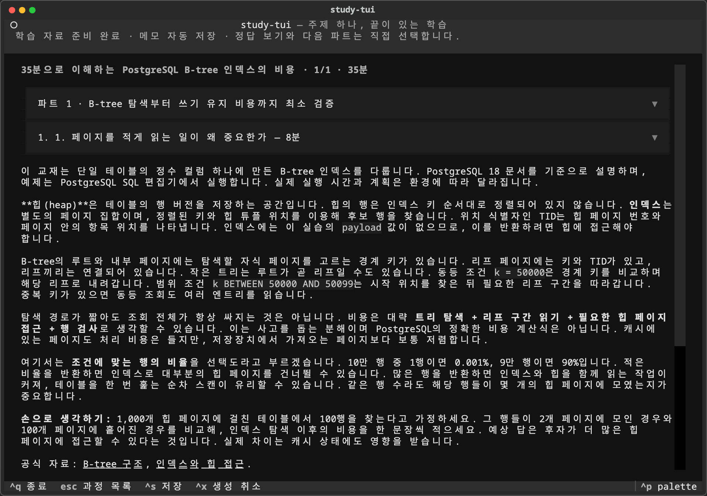
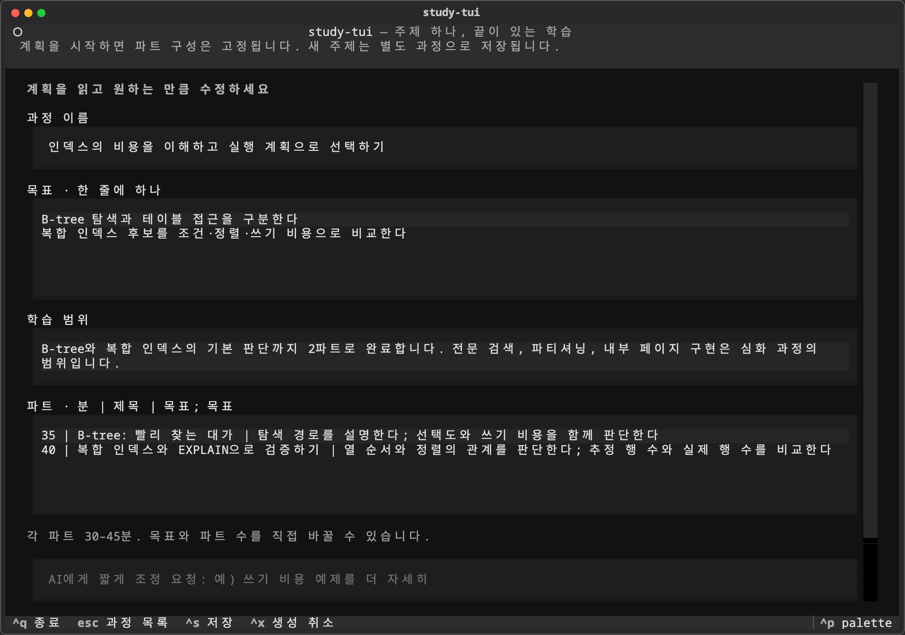
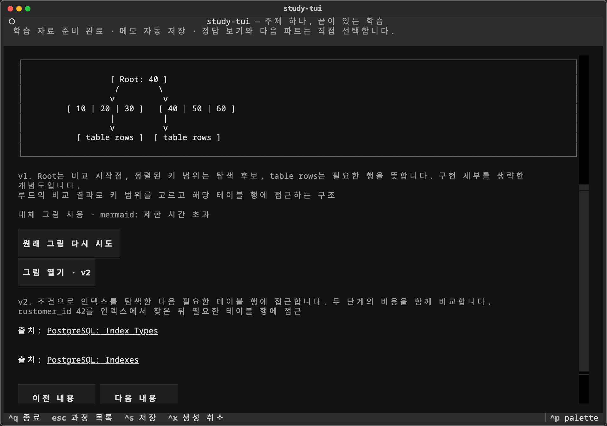
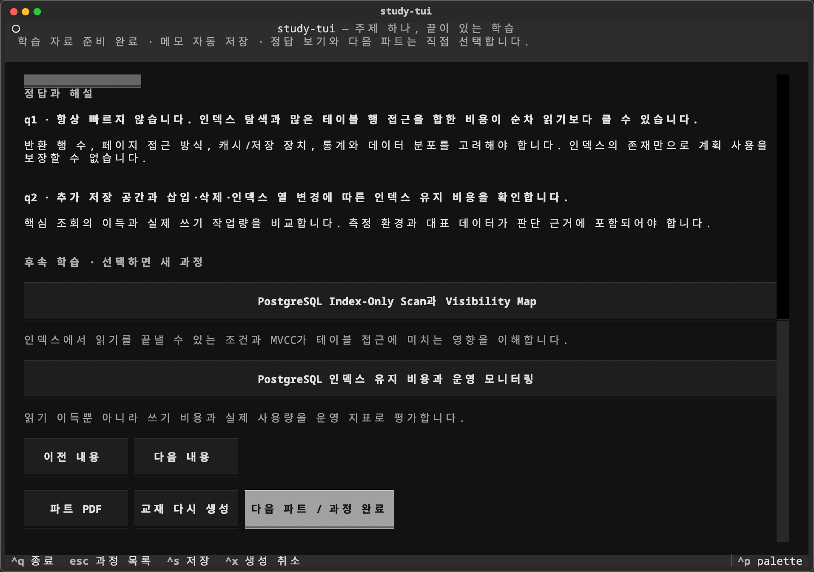
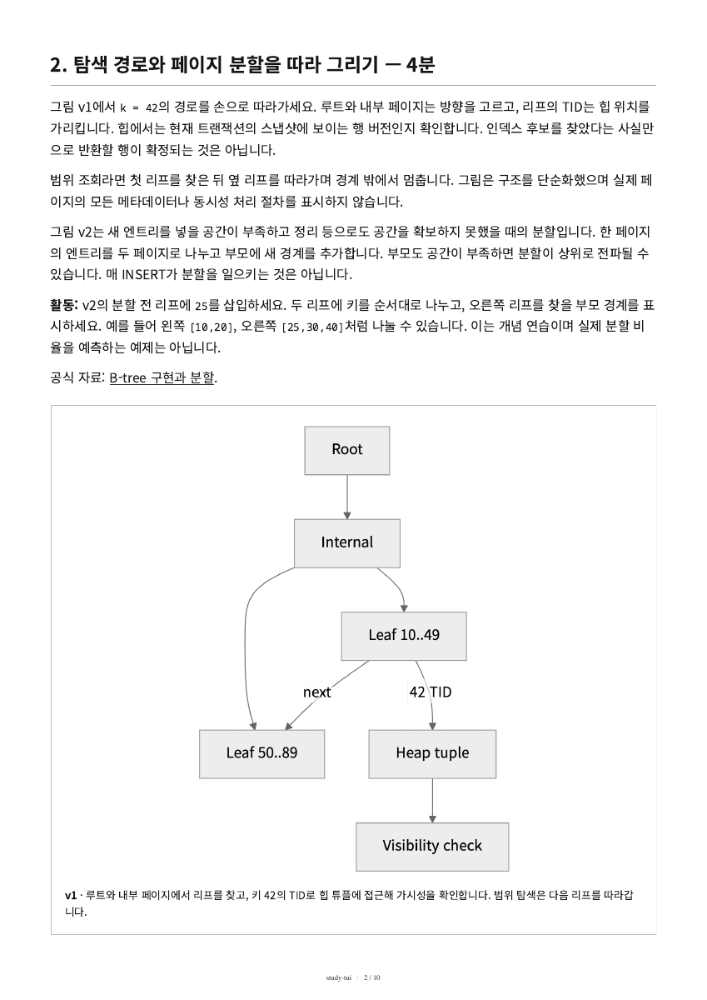

# study-tui

**주제 하나, 끝이 있는 학습.** 백엔드 주제를 입력하면 학습 계획을 만들고, 30~45분 단위의 교재와 그림·퀴즈·인쇄용 PDF로 공부하는 개인용 로컬 TUI입니다.

Python·Textual로 실행하며 별도 HTTP 서버가 필요하지 않습니다. AI 생성은 기존 ChatGPT 로그인으로 Codex CLI를 호출합니다.

> **공개 저장소입니다.** 2026-10-08에 소스코드를 공개했습니다. 프로젝트 전체의 라이선스는 아직 결정하지 않았습니다. `study-tui`는 임시 작업명입니다.



*실제 구독 CLI로 생성하고 QA한 교재를 저장 후 다시 연 화면입니다. 화면 캡처의 생성 방법은 [QA 기록](docs/qa.md)에 있습니다.*

## 할 수 있는 일

- **계획 검토:** 주제를 직접 입력하고, AI가 제안한 목표·범위·파트를 일반 텍스트로 수정한 뒤 시작합니다.
- **파트 학습:** 개념, 동작 원리, 실무 예시, 그림과 간단한 퀴즈를 섹션별로 읽습니다. Mermaid/SVG·이미지는 OS 뷰어로, ASCII 도식은 TUI에서 봅니다.
- **자율적인 퀴즈:** 답 메모를 쓰거나 종이에서 풉니다. 정답은 원할 때 바로 열며 채점이나 통과 조건이 없습니다.
- **저장과 재개:** 교재, 선택한 파트·섹션, 스크롤, 답 메모와 정답 공개 상태를 저장합니다. 저장 교재를 다시 읽을 때 AI를 호출하지 않습니다.
- **파트별 PDF:** 화면과 같은 교재·선택된 그림으로 한글 A4 PDF를 만듭니다. 정답·해설은 문제 뒤 별도 페이지에 둡니다.
- **완료와 복습:** 모든 확정 파트를 직접 완료하면 과정이 끝납니다. 완료 과정도 다시 읽을 수 있고, 심화 주제를 선택할 때만 새 계획을 만듭니다.

## 설치

Python 3.12 이상, Codex CLI와 ChatGPT 로그인이 필요합니다. 아래 명령은 macOS arm64 / Python 3.12.14 / Codex CLI 0.160.1에서 확인했습니다. Codex 설치·로그인은 [공식 인증 안내](https://learn.chatgpt.com/docs/auth)를 따릅니다.

```bash
git clone https://github.com/zzoe2346/study-tui.git
cd study-tui

python3.12 -m venv .venv
source .venv/bin/activate
python -m pip install -r requirements.lock
python -m pip install -e . --no-deps
python -m playwright install chromium

codex --version
codex login status
study-tui
```

`requirements.lock`에는 실행·개발 의존성의 고정 버전이 들어 있습니다. Chromium은 그림과 PDF 렌더링에 사용합니다. Mermaid와 한글·고정폭 폰트는 패키지에 포함되어 저장 교재를 렌더링할 때 CDN이나 별도 Node.js 설치가 필요하지 않습니다.

ChatGPT 로그인이 없다면 터미널에서 `codex login`을 먼저 실행하세요. 앱은 로그인 상태를 확인하며 사용자 인증·글로벌 Codex 설정을 편집하지 않습니다. API 키 인증으로 생성하거나 유료 API로 자동 전환하지 않습니다. **기존 구독의 사용 한도는 적용되며**, 네이티브 이미지 생성도 Codex 사용량에 포함됩니다. [Codex 이미지 생성 안내](https://learn.chatgpt.com/docs/image-generation).

AI 호출 없이 화면과 PDF를 확인하려면 별도 데이터 폴더로 데모를 실행합니다.

```bash
study-tui --demo --data-dir ./data/demo
```

데모는 PostgreSQL 인덱스의 고정 예제 교재를 사용합니다. 입력한 임의 주제의 교재를 생성하지 않습니다.

## 사용

1. 주제를 입력하고 Enter 또는 **학습 계획 만들기**를 선택합니다.
2. 제목·목표·범위를 수정합니다. 파트는 `분 | 제목 | 목표; 목표` 형식으로 한 줄씩 편집하거나 AI에 짧게 조정을 요청합니다.
3. **이 계획으로 시작**을 선택하고 교재 생성이 끝나면 섹션을 읽습니다. 파트·섹션 선택기로 앞뒤 내용을 다시 볼 수 있습니다.
4. 퀴즈에서 메모하거나 종이에 풀고 **정답과 해설 보기**를 선택합니다. 답을 쓰지 않아도 진행할 수 있습니다.
5. **다음 파트 / 과정 완료**로 현재 파트를 완료합니다. 뒤의 파트를 먼저 열었어도 남은 미완료 파트를 마쳐야 과정이 완료됩니다.
6. **파트 PDF**로 현재 파트의 인쇄용 교재를 엽니다. 완료 후 관심 있는 후속 주제를 선택하면 새 초안을 검토합니다.

| 조작 | 기능 |
| --- | --- |
| Tab / Shift+Tab | 입력·선택·버튼 사이 이동 |
| Enter | 주제 제출, 조정 요청, 선택한 버튼 실행 |
| Ctrl+S | 현재 계획 또는 학습 진행 저장 |
| Ctrl+X | 진행 중인 생성 취소 |
| Esc | 생성 중 취소, 평상시 과정 목록으로 이동 |
| Ctrl+Q | 진행 저장 후 종료 |

한글과 고정폭 글꼴을 지원하는 터미널을 사용하세요. 최소 80×24 화면에서 조작을 확인했으며, 본문과 그림을 편하게 읽으려면 더 넓은 창을 권장합니다.

<details>
<summary>실제 실행 화면: 계획 편집 · ASCII 대체 · 정답과 후속 학습</summary>

고정 데모 과정의 계획을 편집하는 화면입니다.



실제 Mermaid 렌더러의 제한 시간을 짧게 설정해 실패를 유도하고, 같은 교재에 미리 저장한 ASCII 후보로 전환한 화면입니다. 대체 이유와 원본 재시도 버튼도 표시합니다.



정답을 공개한 뒤 해설·후속 주제를 읽는 데모 화면입니다.



</details>

<details>
<summary>실제 생성한 한글 PDF</summary>

위 실제 교재의 PDF 2페이지입니다. 전체 10페이지를 확인했고, 퀴즈는 8페이지·정답과 해설은 9페이지에 있습니다.



</details>

## 저장과 생성 실패

기본 데이터 폴더는 OS별 사용자 앱 데이터 위치입니다. macOS에서는 `~/Library/Application Support/study-tui`이며 `--data-dir`로 바꿀 수 있습니다. SQLite에 진행과 메타데이터를, 로컬 파일에 교재 JSON·그림·PDF를 저장합니다. 다른 기기로 옮길 때는 데이터 폴더 전체를 함께 보관하세요.

생성·취소·검증 실패 시 이전 교재를 유지합니다. 그림 생성이나 렌더링이 실패하면 **같은 교재에 저장한 Mermaid/SVG·ASCII 후보**를 순서대로 사용합니다. 대체도 모두 실패하면 미완성을 안내하고 직접 재시도할 수 있습니다. 대체를 위해 AI를 추가 호출하거나 무제한 재시도하지 않습니다.

로그인·구독 한도·네트워크 오류가 나면 저장된 교재를 계속 읽거나 연결을 확인한 뒤 직접 재시도합니다. 새 AI 생성에는 네트워크가 필요합니다. 저장 교재·그림·PDF 열람은 추가 AI 호출 없이 가능합니다.

| 실행 옵션 | 용도 |
| --- | --- |
| `--data-dir PATH` | 학습 데이터 위치 지정 |
| `--codex PATH` | Codex CLI 실행 파일 지정 |
| `--search cached\|live` | 검색 모드 선택; 기본 cached |
| `--plan-timeout SECONDS` | 계획 생성 제한 시간; 기본 180초 |
| `--lesson-timeout SECONDS` | 교재 생성 제한 시간; 기본 600초 |
| `--no-images` | 네이티브 이미지 호출 없이 저장 후보 사용 |
| `--demo` | AI 호출 없는 고정 예제 |

데이터 폴더의 `settings.json`에서도 검색 모드, 생성·PDF 제한 시간과 `native_images`를 설정할 수 있습니다. 앱은 모델명을 지정하지 않고 설치 CLI의 기본 모델을 사용합니다.

## 검증과 개발

2026-10-08 기준 **77개 테스트가 통과**했습니다. 실제 구독 CLI로 계획·교재·네이티브 PNG를 생성했고, 한글 PDF와 실행 TUI 화면을 직접 확인했습니다. 재생성 실패 시 이전 자료 보존, 저장·재개, 파트 완료, 자식 프로세스 취소와 저장 후보 기반 대체를 포함합니다. 구체적인 증거와 검증 경계는 [QA 기록](docs/qa.md)에 있습니다.

```bash
python -m pytest -q
```

실환경 확인은 macOS arm64 기준입니다. Linux·Windows의 뷰어 호출과 프로세스 정리는 추가 확인이 필요합니다. 생성 교재의 구조·참조 검증은 내용의 사실 정확성을 보증하지 않으며, SQL 예제는 앱이 실행하지 않습니다. 첫 버전은 파트별 PDF만 지원합니다.

- [제품 요구사항](docs/requirements.md)
- [상세설계와 데이터 계약](docs/lld.md)
- [QA 기록과 화면 캡처 근거](docs/qa.md)
- [협업 지침](AGENTS.md)
- [포함한 Mermaid·폰트의 출처와 라이선스](src/study_tui/assets/NOTICE.md)

프로젝트 전체의 라이선스는 아직 미정입니다. 포함한 외부 자산의 MIT·SIL OFL 라이선스는 해당 자산에 적용됩니다.
