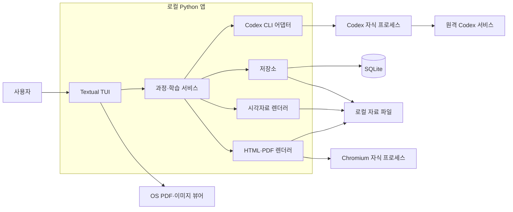
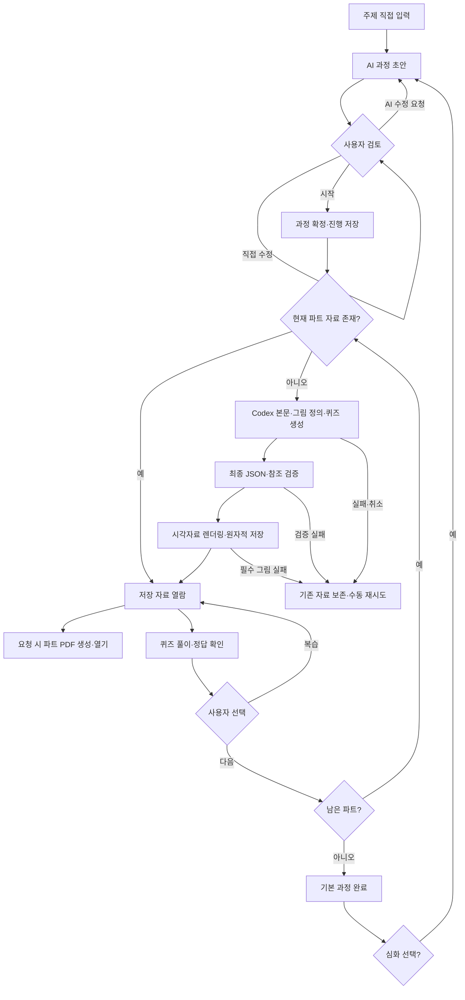

# 상세설계 (LLD)

검토 기준: 2026-10-07. 제품의 확정 요구사항은 [requirements.md](requirements.md), 작업 규칙은 [AGENTS.md](../AGENTS.md)를 따른다. 이 문서는 구현 기준을 제시하며, 앱 코드·의존성·AI 생성 실행은 아직 없다.

## 1. 목표와 첫 버전 범위

사용자가 직접 입력한 백엔드 주제를 완료 지점이 있는 과정으로 만들고, 30~45분 단위로 공부할 자료와 시각자료, 간단한 퀴즈, 파트별 인쇄용 PDF를 제공한다. 생성 자료와 진행을 저장해 중단 후 재개한다.

| 구분 | 결정 | 근거·적용 범위 |
| --- | --- | --- |
| 사용자 확정 | 주제 직접 입력 | 이력서 업로드·분석과 앱 내부 주제 추천은 제외한다. 다른 GPT 대화의 추천 주제를 입력할 수 있다. |
| 사용자 확정 | AI 과정 초안 → 사용자 조정 → 시작 | 긴 목적·난이도 설문과 진단 시험을 강제하지 않는다. |
| 사용자 확정 | 유한한 기본 과정, 선택 심화 과정 | 심화 후보와 공부할 이유를 제시하고, 선택한 주제로 새 과정을 만든다. |
| 사용자 확정 | 단순 퀴즈와 사용자 판단 | 자동 채점·AI 답안 평가·통과 점수·강제 재시험·적응형 보충은 없다. |
| 사용자 확정 | 시각자료 필수, 파트별 PDF | 첫 버전에 과정 합본은 없다. 본문·예시·그림·문제와 분리된 정답을 포함한다. |
| 사용자 확정 | Python + Textual | Java/Spring 경험에 맞출 필요가 없다. Textual의 화면·입력·worker 기능을 활용한다. |
| 사용자 확정 | Codex CLI 자식 프로세스 + 기존 ChatGPT 구독 인증 | Responses API 직접 연동, API key 인증과 별도 유료 API로의 자동 전환은 없다. 구독 한도는 적용된다. |
| 사용자 확정 | 개인용 로컬 앱, 별도 HTTP 서버 없음 | AI 추론·검색은 원격 Codex 서비스에 의존한다. 오프라인 AI 앱으로 설명하지 않는다. |
| 설계 기본값 | SQLite + 로컬 파일 | 진행·참조·상태는 DB에, 본문 JSON·SVG·이미지·PDF는 파일에 둔다. 별도 DB 서버가 필요 없다. |
| 설계 기본값 | HTML/CSS 교재 템플릿 + Playwright/Chromium PDF | 글·코드·벡터 그림을 같은 인쇄 레이아웃으로 다루기 쉽다. 웹 UI가 아니다. |
| 설계 기본값 | Mermaid/SVG 기본, 필요한 생성 삽화 병행 | 도식으로 개념 설명을 먼저 보장한다. 구독 경로 이미지 자동화는 검증 후 연결한다. draw.io 동시 통합은 필수가 아니다. |
| 설계 기본값 | 진행 자동 저장, AI 작업 동시 실행 1개 | 작은 개인 앱에서 복구와 구독 사용량 관리를 단순하게 유지한다. |

SQLite는 별도 서버 프로세스를 요구하지 않는 내장 DB이고, Playwright의 `page.pdf()`는 인쇄 CSS로 PDF를 생성한다. 위 조합은 설계상의 채택안이며 개별 도구를 사용자가 직접 확정했다는 뜻은 아니다. [Python sqlite3](https://docs.python.org/3/library/sqlite3.html), [Playwright PDF](https://playwright.dev/python/docs/api/class-page#page-pdf).

## 2. 구성과 책임

Python 앱 한 개가 Textual 이벤트 루프, 내부 서비스, 저장소를 소유한다. Codex CLI와 Chromium은 필요한 동안만 실행되는 자식 프로세스다. 네트워크 서버나 서비스 간 HTTP API를 만들지 않는다.



| 구성요소 | 책임 |
| --- | --- |
| `tui/` | 과정 목록·초안·본문·퀴즈·심화 화면, 키 바인딩, 작업 상태 표시. SQL·CLI 출력 파싱은 하지 않는다. |
| `services/course.py` | 과정 초안 생성·수정·확정, 유한한 파트 목록, 심화 후보로 새 과정 시작. |
| `services/learning.py` | 파트 자료 재사용·생성·재생성, 정답 공개, 복습·다음 선택, 중단 후 복구. |
| `adapters/codex.py` | 인증 사전 확인, subprocess·JSONL 처리, 최종 JSON 검증, 취소·실패 정규화. |
| `storage/` | SQLite 트랜잭션, 자료 파일 원자적 저장, 현재 자료 참조와 진행 저장. |
| `rendering/visuals.py` | Mermaid → SVG, SVG 검사, 생성 이미지 산출물 수집·검증. |
| `rendering/lesson.py`, `pdf.py` | 공통 학습 모델에서 TUI 표시 데이터와 인쇄 HTML/PDF 생성. |
| `models.py`, `schemas/`, `templates/` | 데이터 계약, 생성 JSON Schema, 앱이 관리하는 교재 템플릿·폰트·로컬 Mermaid 번들. |

위 경로는 향후 구현 배치안이다. 현재 저장소에 실행 패키지나 빌드·테스트 명령이 있다는 뜻은 아니다. Python 세부 버전과 패키지 고정 버전은 구현 시작 시 호환 확인 후 정한다.

## 3. 화면과 키 동작

기본 이동은 `Tab`/방향키, 선택은 `Enter`, 도움말은 `F1`, 뒤로는 `Esc`다. 문자 입력에 포커스가 있으면 글자 단축키는 입력 문자로 처리한다. 종료는 `Ctrl+Q`이며 진행을 저장하고 실행 중 작업을 취소한다.

| 화면 | 표시·입력 | 동작 |
| --- | --- | --- |
| 과정 목록 | 주제·현재 파트·진행, 새 주제 입력 버튼 | 새 과정 또는 저장된 과정의 마지막 위치로 재개. |
| 주제 입력 | 주제 한 줄 | `Enter`로 초안 요청. 빈 입력은 안내하며 설문·진단을 요구하지 않는다. |
| 과정 초안 | 목표·범위·파트 제목·각 파트 목표/분량 | `e` 직접 수정, `a` 짧은 수정 요청으로 AI 재작성, `s` 확정·시작. AI 수정은 버튼을 누를 때만 실행한다. |
| 파트 본문 | 개념·원리·예시·그림 설명·출처 | 스크롤, `v` 선택 그림을 OS 뷰어로 열기, `q` 퀴즈, `p` 파트 PDF, `n` 사용자 판단으로 다음. |
| 퀴즈 | 문제·선택 입력란, 종이 풀이 안내 | `Ctrl+Enter` 정답·해설 공개, `n` 사용자 판단으로 다음. 답 입력·제출·정답 공개를 이동 조건으로 요구하지 않는다. |
| 정답·다음 선택 | 정답·해설, 복습·다음·심화 후보 | `r` 본문 복습, `n` 현재 파트 완료 표시 후 다음 파트. 마지막 파트는 기본 과정 완료 화면으로 이동한다. |
| 파트 PDF | 생성 상태·저장 위치 | `p` 현재 파트 PDF 생성/열기, `x` 원하는 경로로 내보내기. OS 뷰어에서 인쇄한다. |
| 과정 완료·심화 | 완료한 기본 과정, 후보 주제와 공부할 이유 | 후보 선택 시 새 과정 초안을 검토한다. 선택하지 않아도 완료 상태를 유지한다. |
| 생성 작업 표시 | 단계·경과 시간·최근 작업 설명 | `Esc` 취소. 다른 저장 자료 열람은 가능하며 완료되지 않은 자료는 학습 본문으로 공개하지 않는다. |

TUI는 본문·코드·퀴즈·그림 설명을 표시하고, 실제 SVG/이미지와 인쇄 레이아웃은 외부 뷰어로 연다. 터미널 그래픽 프로토콜 지원을 첫 버전 필수로 두지 않는다. PDF 내보내기는 퀴즈 풀이 여부와 무관하게 허용한다. 정답 공개는 앱에서만 상태로 제어하고, PDF에는 별도 정답 페이지를 넣는다.

## 4. 생성 흐름과 상태



`N → B`는 원래 과정 연장이 아니라 선택 주제의 **새 과정 초안**이다. 다음 파트 자료는 사용자가 진입할 때 생성하며 과정 전체를 미리 자동 생성하지 않는다.

| 상태 축 | 값 | 의미 |
| --- | --- | --- |
| 과정 `status` | `draft`, `active`, `completed` | 사용자 초안 확정·기본 과정 완료 상태. |
| 작업 `status` | `queued`, `running`, `succeeded`, `failed`, `cancelled`, `interrupted` | 생성·렌더링 시도의 실행 상태. `interrupted`는 앱 강제 종료 후 복구 시 표시한다. |
| 자료 `state` | `staging`, `ready`, `failed` | JSON 검증·필수 시각자료가 끝난 자료만 `ready`. |
| 파트 학습 `status` | `not_started`, `studying`, `completed` | 본문 열람과 사용자의 다음 선택으로 변한다. 생성 성공이나 퀴즈 정답은 완료 조건이 아니다. |
| PDF 상태 | `missing`, `ready`, `failed` | 해당 자료·템플릿 버전의 PDF 상태. PDF 실패가 본문 학습 완료를 취소하지 않는다. |

복습은 기존 완료를 되돌리지 않는다. 저장하는 답안은 문자열 메모일 뿐이며 정답 비교·점수·평가 모델은 만들지 않는다. 다음 이동에 정답 공개나 답안 입력을 강제하지 않는다.

## 5. 내부 인터페이스와 데이터 계약

함수는 파일 경로나 예외가 섞인 임의 dict 대신 아래 모델을 주고받는다. Python 데이터 클래스와 JSON Schema 검증을 기본으로 하고 검증 라이브러리의 버전은 구현 시 고정한다.

| 모델 | 주요 필드 |
| --- | --- |
| `CoursePlan` | `schema_version`, `topic`, `title`, `objectives[]`, `scope`, `parts[]` |
| `PartOutline` | `ordinal`, `title`, `objectives[]`, `minutes`(30~45) |
| `Lesson` | `schema_version`, `title`, `minutes`, `sections[]`, `visuals[]`, `quizzes[]`, `sources[]`, `follow_ups[]` |
| `GenerationRequest` | `job_id`, `kind`(plan/lesson), `prompt`, `schema_path`, `job_dir`, `search_mode`, `timeout_seconds` |
| `GenerationResult` | `payload`, `job_id`, `usage`(제공된 값만), `cli_version`, `reported_model`(모르면 null) |
| `JobEvent` | `job_id`, `phase`, `message`, `elapsed_seconds`. 총량을 모르는 작업에 임의의 진행률을 붙이지 않는다. |
| `MaterialRef` / `PdfRef` | `id`, `relative_path`, `sha256`, `input_hash` / `render_hash` |
| `AssetRef` | `visual_id`, `kind`, `source_path`, `rendered_path`, `sha256`, `status`. 경로는 `data_root` 기준이며 완성된 자산만 렌더러에서 반환한다. |
| `ProgressSnapshot` | `part_id`, `material_id`(nullable), `status`, `section_index`, `answers`, `answers_revealed`, `updated_at` |
| `GenerationFailure` | `category`, `safe_message`, `retryable`, `exit_code`(nullable). 비밀정보와 CLI 생로그는 포함하지 않는다. |

```python
# 설계 인터페이스. 모델 타입·예외·Callable·Path는 구현 시 정의하거나 import한다.
async def propose_plan(topic: str, feedback: str | None = None,
                       previous: CoursePlan | None = None) -> CoursePlan: ...
def save_draft(course_id: str, plan: CoursePlan) -> None: ...
def start_course(course_id: str) -> ProgressSnapshot: ...
async def load_or_generate(part_id: str, regenerate: bool = False) -> MaterialRef: ...
async def generate(request: GenerationRequest,
                   on_event: Callable[[JobEvent], None]) -> GenerationResult: ...
async def render_visuals(lesson: Lesson, material_dir: Path) -> list[AssetRef]: ...
async def export_part(part_id: str, destination: Path | None = None) -> PdfRef: ...
def save_progress(snapshot: ProgressSnapshot) -> None: ...
def reveal_answers(part_id: str) -> None: ...
def choose_next(part_id: str) -> str | None: ...
def resume_course(course_id: str) -> ProgressSnapshot: ...
async def cancel_job(job_id: str) -> None: ...
```

### 생성 JSON Schema

아래는 본문 생성의 전체 필드 계약이다. 생성 응답에 DB ID·로컬 절대 경로·Python 코드·임의 HTML을 요청하지 않는다. 자료·그림·문제의 ID와 파일명은 앱이 검증/생성한다. 스키마는 앱 검증 기준이며 CLI의 지원 범위와 조합 동작은 구현 첫 단계에서 확인한다.

```json
{
  "$schema": "https://json-schema.org/draft/2020-12/schema",
  "type": "object",
  "additionalProperties": false,
  "required": ["schema_version", "title", "minutes", "sections", "visuals", "quizzes", "sources", "follow_ups"],
  "properties": {
    "schema_version": {"const": 1},
    "title": {"type": "string", "minLength": 1},
    "minutes": {"type": "integer", "minimum": 30, "maximum": 45},
    "sections": {"type": "array", "minItems": 4, "items": {"$ref": "#/$defs/section"}},
    "visuals": {"type": "array", "minItems": 1, "items": {"$ref": "#/$defs/visual"}},
    "quizzes": {"type": "array", "minItems": 1, "items": {"$ref": "#/$defs/quiz"}},
    "sources": {"type": "array", "minItems": 1, "items": {"$ref": "#/$defs/source"}},
    "follow_ups": {"type": "array", "minItems": 1, "items": {"$ref": "#/$defs/follow_up"}}
  },
  "$defs": {
    "section": {
      "type": "object", "additionalProperties": false,
      "required": ["kind", "title", "body_markdown", "visual_ids", "source_ids"],
      "properties": {
        "kind": {"enum": ["concept", "mechanism", "example", "summary"]},
        "title": {"type": "string", "minLength": 1},
        "body_markdown": {"type": "string", "minLength": 1},
        "visual_ids": {"type": "array", "items": {"type": "string"}},
        "source_ids": {"type": "array", "items": {"type": "string"}}
      }
    },
    "visual": {
      "type": "object", "additionalProperties": false,
      "required": ["id", "kind", "source", "caption", "alt_text"],
      "properties": {
        "id": {"type": "string", "pattern": "^v[1-9][0-9]*$"},
        "kind": {"enum": ["mermaid", "svg", "image_prompt"]},
        "source": {"type": "string", "minLength": 1},
        "caption": {"type": "string", "minLength": 1},
        "alt_text": {"type": "string", "minLength": 1}
      }
    },
    "quiz": {
      "type": "object", "additionalProperties": false,
      "required": ["id", "question", "answer", "explanation"],
      "properties": {
        "id": {"type": "string", "pattern": "^q[1-9][0-9]*$"},
        "question": {"type": "string", "minLength": 1},
        "answer": {"type": "string", "minLength": 1},
        "explanation": {"type": "string", "minLength": 1}
      }
    },
    "source": {
      "type": "object", "additionalProperties": false,
      "required": ["id", "title", "url", "checked_at"],
      "properties": {
        "id": {"type": "string", "pattern": "^s[1-9][0-9]*$"},
        "title": {"type": "string", "minLength": 1},
        "url": {"type": "string", "format": "uri"},
        "checked_at": {"type": ["string", "null"]}
      }
    },
    "follow_up": {
      "type": "object", "additionalProperties": false,
      "required": ["topic", "reason"],
      "properties": {
        "topic": {"type": "string", "minLength": 1},
        "reason": {"type": "string", "minLength": 1}
      }
    }
  }
}
```

과정 초안은 별도의 다음 스키마로 요청한다.

```json
{
  "$schema": "https://json-schema.org/draft/2020-12/schema",
  "type": "object", "additionalProperties": false,
  "required": ["schema_version", "topic", "title", "objectives", "scope", "parts"],
  "properties": {
    "schema_version": {"const": 1},
    "topic": {"type": "string", "minLength": 1},
    "title": {"type": "string", "minLength": 1},
    "objectives": {"type": "array", "minItems": 1, "items": {"type": "string", "minLength": 1}},
    "scope": {"type": "string", "minLength": 1},
    "parts": {
      "type": "array", "minItems": 1,
      "items": {
        "type": "object", "additionalProperties": false,
        "required": ["ordinal", "title", "objectives", "minutes"],
        "properties": {
          "ordinal": {"type": "integer", "minimum": 1},
          "title": {"type": "string", "minLength": 1},
          "objectives": {"type": "array", "minItems": 1, "items": {"type": "string", "minLength": 1}},
          "minutes": {"type": "integer", "minimum": 30, "maximum": 45}
        }
      }
    }
  }
}
```

추가 검증은 다음 계약을 확인한다. 파트 순서는 1부터 연속, ID는 배열 안에서 고유, 참조 대상은 존재하며 모든 그림이 본문에서 참조되고 설명되어야 한다. `concept`·`mechanism`·`example`·`summary`를 모두 포함한다. URL은 HTTP(S)만 허용한다. `checked_at`은 실제 확인 정보가 있을 때만 날짜를 넣고 모르면 null로 둔다. AI가 만든 날짜를 검증된 날짜로 취급하지 않는다. Markdown의 원시 HTML과 원격 이미지는 렌더링하지 않는다. 내용의 정확성은 출처와 사용자 검토로 확인하며, 스키마 검증 성공을 사실 확인 완료로 부르지 않는다.

## 6. SQLite와 로컬 파일

DB는 메타데이터와 진행을 저장하고 큰 자료는 파일로 둔다. 모든 DB ID는 앱이 생성하는 UUID이며, 시각은 UTC ISO 8601로 저장하고 화면에서 현지 시간으로 변환한다. 외래 키를 활성화하고 SQL 값은 파라미터로 전달한다. 현재 파트가 같은 과정에, 현재 자료가 같은 파트에 속하는지도 저장 시 확인한다. 짧은 트랜잭션으로 쓰며 AI 대기 중 DB 잠금을 유지하지 않는다. 첫 버전은 앱 안의 DB 작업을 직렬화하고 연결을 스레드 간 공유하지 않는다.

| 테이블 | 주요 필드·관계 |
| --- | --- |
| `courses` | `id PK`, `topic`, `title`, `objectives_json`, `scope`, `plan_json`, `plan_revision`, `status`, `current_part_id FK parts NULL`, `parent_course_id FK courses NULL`, `created_at`, `updated_at` |
| `parts` | `id PK`, `course_id FK courses`, `ordinal`, `outline_json`, `input_hash`, `active_material_id FK materials NULL`。`UNIQUE(course_id, ordinal)`。 |
| `materials` | `id PK`, `part_id FK parts`, `revision`, `state`, `input_hash`, `lesson_path`, `content_hash`, `schema_version`, `prompt_version`, `cli_version`, `reported_model NULL`, `search_mode`, `created_at`。`UNIQUE(part_id, revision)`。 |
| `assets` | `id PK`, `material_id FK materials`, `visual_id`, `kind`, `source_path`, `rendered_path`, `sha256`, `status`。`UNIQUE(material_id, visual_id)`。 |
| `progress` | `part_id PK/FK parts`, `material_id FK materials NULL`, `status`, `section_index`, `answers_json`, `answers_revealed`, `updated_at`. 답 메모는 해당 자료의 문제 ID에 연결한다. 채점·점수·통과 필드는 없다. |
| `jobs` | `id PK`, `course_id FK courses`, `part_id FK parts NULL`, `kind`(plan/lesson/visual/pdf), `status`, `phase`, `started_at`, `finished_at NULL`, `error_category NULL`, `job_dir`, `output_material_id FK materials NULL` |

PDF 메타데이터는 각 자료 디렉터리의 `render-manifest.json`에 `render_hash`, `pdf_path`, `sha256`, `status`, `template_version`으로 둔다. `render_hash`는 본문 JSON·그림 파일·템플릿·폰트·렌더러 설정의 해시로 계산한다. 별도 배포 서버, 사용자 테이블, 채점 이력, 범용 작업 큐는 추가하지 않는다.

```text
<data_root>/
  study.sqlite3
  settings.json                 # 앱의 비밀정보가 없는 설정
  courses/<course_id>/
    plan-r<revision>.json        # 저장된 초안·확정 과정
    parts/<part_id>/materials/<material_id>/
      lesson.json               # 검증된 본문·문제·분리된 정답 필드
      progress-snapshot.json    # 자료 교체 전 이전 답 메모 보존용
      visuals/v1.mmd            # 그림 정의. SVG는 v1.source.svg
      visuals/v1.svg            # 검사·정리된 표시용 그림
      images/v2.png             # 생성 이미지 연동 검증 후 사용
      lesson.html
      lesson.pdf
      render-manifest.json
  jobs/<job_id>/                # Codex 작업 루트. 앱 코드를 두지 않는다
    input.json
    schema.json
    final.json
    diagnostics.json            # 실패 분류·경과 시간 등의 안전한 요약
```

`data_root`는 앱 전용 디렉터리로 설정 가능하다. macOS의 설계 기본값은 `~/Library/Application Support/study-tui`이며 다른 OS의 기본 경로는 구현 시 정한다. 이 경로는 설계 예시이며 이번에 생성하지 않는다. 개발용으로 저장소 안의 `data/`를 지정하면 기존 `.gitignore`로 제외된다. DB의 파일 참조는 `data_root` 기준 상대 경로이며, 절대 경로·`..`·심볼릭 링크를 통한 루트 외 참조는 거부한다.

### 재사용·수정·복구

1. 초안을 수정하면 `plan_revision`을 늘리고 새 계획 파일을 저장한다. 시작 전에는 본문을 생성하지 않는다. 제목·목표·순서·분량을 검증한 뒤 `parts`를 만든다.
2. 시작 후 확정 계획은 첫 버전에서 고정한다. 범위를 바꾸려면 명시적으로 새 과정 초안을 만들고, 원래 자료와 진행을 보존한다. 기존 과정 재개와 구분한다.
3. 기존 `active_material_id`가 `ready`이고 필요한 파일과 해시가 일치하면 그대로 연다. AI를 호출하지 않는다. `input_hash`에는 확정 계획·파트 목표·선행 파트 요약·프롬프트/스키마 버전·검색 모드·모델 지정을 포함한다.
4. 사용자가 자료 재생성을 선택하면 새 자료 리비전을 만든다. 이전 자료는 삭제하지 않는다. 새 자료가 완전히 저장된 뒤 DB 트랜잭션으로 현재 참조를 바꾼다. 실패하면 이전 자료를 유지한다.
5. 재생성으로 문제가 바뀌면 이전 답 메모를 새 문제에 연결하지 않는다. 전환할 때 해당 파트의 답 메모와 정답 공개 상태를 초기화하되 학습 완료 상태는 유지한다. 이전 메모는 전환 전에 이전 자료 폴더의 `progress-snapshot.json`으로 보존한다.
6. 파일은 같은 디렉터리의 임시 파일에서 rename한 뒤 DB 참조를 갱신한다. 비정상 종료로 남은 `staging`이나 참조 없는 파일은 재개 시 대조하며 완성된 자료 대신 공개하지 않는다.
7. 본문 스크롤 위치는 0.5초, 답 메모는 입력 후 1초 동안 변경을 모아 저장한다. 정답 공개·다음/복습 선택·화면 종료는 즉시 저장한다. 재개는 `current_part_id`와 마지막 위치를 읽고, 정답은 사용자가 공개한 경우에만 표시한다.
8. 시작 시 남아 있는 `running` 작업을 `interrupted`로 바꾼다. 중간 JSONL을 이어지는 본문으로 취급하지 않고 사용자가 재시도한다. 저장된 자료는 네트워크가 없어도 볼 수 있다.

## 7. Codex CLI 어댑터

### 확인된 내용과 미검증 경계

이 컴퓨터에서 읽기 전용으로 `codex-cli 0.160.1`, `codex login status`의 ChatGPT 로그인 성공, `codex exec --help`의 아래 옵션을 확인했다. `codex features list`의 `image_generation stable true`도 확인했다. **실제 `codex exec` 자료 생성·이미지 생성·산출물 수집은 실행하지 않았다.** 기능 활성화는 전체 흐름의 성공을 증명하지 않는다.

저장된 CLI 인증을 재사용하고 생성 요청은 명시적 사용자 동작마다 한 번 보낸다. ChatGPT 인증은 구독 경로, API key 인증은 사용량 과금 경로이므로 후자로 자동 변경하지 않는다. 인증 파일/토큰을 읽거나 앱 영역으로 복사하지 않는다. [Codex 인증](https://learn.chatgpt.com/docs/auth).

### 호출 계약

다음은 **앞으로 구현할 호출 예시**이며 이번에 실행하는 명령이 아니다.

```python
argv = [
    codex_executable, "exec",
    "--ignore-user-config", "--ephemeral", "--skip-git-repo-check",
    "--sandbox", "read-only", "--json", "--color", "never",
    "--output-schema", str(schema_path),
    "--output-last-message", str(final_path),
    "--cd", str(job_dir),
    "-c", 'forced_login_method="chatgpt"',
    "-c", f'web_search="{search_mode}"',
    "-",
]
# search_mode는 앱이 선택하는 cached/live 열거값이다. 사용자 입력을 넣지 않는다.
# asyncio.create_subprocess_exec(*argv, stdin=PIPE, stdout=PIPE, stderr=PIPE,
#                                cwd=job_dir, env=child_env)
# UTF-8 프롬프트를 stdin에 보내고 닫는다. shell=True를 사용하지 않는다.
```

`schema_path`·`final_path`·`job_dir`는 앱이 만드는 작업 전용 경로다. `read-only`로 모델의 파일 변경을 제한하고 CLI의 `-o`로 최종 응답을 수집한다. 앱이 검증한 JSON에서 자료 파일을 만든다. 이 옵션 조합의 출력 파일 쓰기는 구현 시작 시 확인한다. `--ignore-user-config`는 글로벌 설정을 읽지 않으며 인증은 유지한다. 사용자 규칙을 무시하는 `--ignore-rules`는 지정하지 않는다.

같은 실행 환경의 `codex login status` 종료 코드와 인증 방식을 먼저 확인한다. ChatGPT 이외·미인증·판별 불가이면 생성하지 않고 안내한다. 자식 환경에서 `OPENAI_API_KEY`·`CODEX_API_KEY` 등 과금 인증에 쓰이는 변수를 제외하고 다른 공급자를 지정하지 않는다. 모델명은 미정이며 우선 CLI의 구독으로 사용 가능한 기본값을 쓴다. 글로벌 설정과 인증을 앱에서 편집하지 않는다. `forced_login_method`는 호출 단위 보호로 검증하되, 인증 불일치 시 CLI가 로그아웃하는 사양이 있으므로 사전 확인을 필수로 하고 인증이 바뀌면 중단한다. 앱은 자동 로그인·로그아웃을 하지 않는다. CLI의 정상적인 인증 갱신은 CLI가 관리한다.

프롬프트는 요구·확정 계획·대상 파트·선행 요약·출처 정책·스키마를 담는 고정 템플릿과 데이터로 나눈다. 사용자 입력은 JSON 문자열로 데이터 영역에 넣고 셸 문자열·플래그·파일명에 보간하지 않는다. 웹 자료의 지시문은 학습 출처로 취급하며 앱 조작 지시로 채택하지 않는다. 이전 대화 전체를 무제한 전송하지 않고 저장된 요약과 필요한 정의만 보낸다.

일반 개념 설명은 `cached`, DB 버전별 동작·현행 라이브러리 사양 등 최신 확인이 필요한 자료는 `live`를 호출 단위 `-c`로 지정한다. 글로벌 설정은 변경하지 않는다. 본문의 주장에 출처 ID를 연결하고 일차 자료를 우선한다. 검색이 막히면 최신성 보장이 필요한 생성을 완료로 처리하지 않는다. [Codex 웹 검색](https://learn.chatgpt.com/docs/web-search).

### JSONL·최종 JSON·비동기 실행

`--json`은 **한 줄에 한 이벤트인 JSONL**이다. stdout 전체를 단일 JSON으로 파싱하지 않는다. 이벤트와 최종 학습 자료를 구분한다. [Codex 비대화형 실행](https://learn.chatgpt.com/docs/non-interactive-mode).

1. stdout과 stderr를 동시에 비동기로 읽고, stdin을 닫은 뒤에도 자식 프로세스 종료까지 둘 다 소비한다. stdout의 각 줄을 JSON으로 파싱한다.
2. `thread.started`·`turn.started`·`item.*`는 작업 단계/상태 표시용이다. `turn.completed`는 턴 완료 기록이며 자료 JSON이 아니다. `turn.failed`/`error` 또는 비정상 종료는 실패로 기록한다. 모르는 이벤트 종류는 안전하게 무시하고 자료에 넣지 않는다.
3. 작업마다 새 `final.json`을 최종 결과의 기준으로 삼는다. `item.completed`의 중간 메시지나 추론을 최종 자료로 추출하지 않는다.
4. 정상 종료·완료 이벤트·최종 파일 존재를 확인한 뒤 JSON 파싱 → 스키마 → ID/출처/그림 참조 검증을 수행한다. 실패한 결과를 `ready`로 만들지 않는다. 실제 완료/실패 이벤트 형태는 0.160.1의 작은 검증으로 fixture에 남긴다.
5. 출력을 무제한 누적하지 않는다. 설계 초기 상한은 JSONL 한 줄 4MiB, 최종 JSON 8MiB, stderr 요약 64KiB다. 초과하면 `output_limit`으로 중단한다. CLI 버전에 따라 조정이 필요하면 근거를 남긴다.
6. Textual async worker에서 CLI coroutine을 호출하고 메시지로 화면에 알린다. 입력 핸들러 안에서 긴 `worker.wait()`를 하지 않는다. 짧은 SQLite 쓰기 외에 무거운 렌더링/파일 작업은 worker로 실행한다. worker 예외를 TUI 종료로 연결하지 않고 서비스 오류로 표시한다. [Textual Workers](https://textual.textualize.io/guide/workers/).

앱은 AI worker를 하나만 유지하고 중복 요청은 기존 작업을 표시한다. 취소는 coroutine 종료만으로 처리하지 않는다. finally에서 자식 프로세스 종료 요청 → 최대 5초 대기 → 남은 프로세스 kill → wait를 수행한다. macOS/Linux는 전용 프로세스 그룹으로 자손도 종료하고 Windows 방식은 지원 구현 때 검증한다. PDF도 finally에서 브라우저를 닫는다.

시간 제한 설계 기본값은 과정 초안 180초, 본문 600초, PDF 120초이며 설정 가능하다. JSONL 무응답만으로 실패를 판정하지 않는다. 시간 초과·취소·앱 종료에서 부분 결과를 채택하지 않고 진행 위치와 기존 자료를 보존한다.

| 오류 분류 | 처리 |
| --- | --- |
| `cli_missing` / `unsupported_cli` | 설치/호환 상태를 안내한다. 앱이 CLI를 임의로 설치·업데이트하지 않는다. |
| `login_required` / `wrong_auth_method` | 사용자가 CLI에서 ChatGPT 로그인 상태를 확인한 뒤 재시도한다. 앱이 인증을 변경하지 않는다. |
| `quota_exceeded` | 생성을 멈추고 CLI가 반환한 재개 시각이 있으면 표시한다. 저장된 학습은 계속 가능하다. 과금 API로 전환하지 않는다. |
| `network` / `timeout` / `cancelled` | 중간 자료를 공개하지 않고 수동 재시도한다. 취소는 사용자 동작으로 표시한다. |
| `invalid_json` / `invalid_content` / `render_failed` | 안전한 요약을 표시하고 이전 자료를 보존한다. 수정 AI 호출은 사용자가 재시도할 때만 한다. |
| `unknown` | 문자열만으로 과금·인증·재시도 가능 여부를 단정하지 않는다. 종료 코드와 안전한 요약을 남긴다. |

알려진 구조화 오류가 있으면 우선하고 CLI 버전에 맞는 분류를 확인한다. 원시 stderr·프롬프트·추론·토큰을 일반 로그에 저장하지 않는다. `diagnostics.json`은 종류·시각·단계·경과 시간·안전한 실패 분류만 담는다. 무제한 자동 재시도를 하지 않는다.

### 작업 영역과 이미지 생성

Codex의 cwd는 `<data_root>/jobs/<job_id>`다. 앱 코드의 Git 저장소를 넘기지 않는다. 자료 생성은 read-only 출력 중심이며 추가 쓰기 디렉터리나 권한 우회를 지정하지 않는다. cwd와 read-only는 비밀정보를 포함한 전체 파일의 읽기 격리를 보장하지 않으므로 입력/작업 영역에 학습과 관계없는 파일을 넣지 않는다.

그림은 `mermaid`/`svg` 정의를 구조화 응답으로 받아 앱에서 렌더링한다. 생성 이미지가 적합한 개념은 `image_prompt`를 보존한다. CLI 이미지 기능 활성화와 `exec` 호출·최종 이미지 파일/이벤트 수집·취소·사용량 처리는 서로 다른 확인이며, 후자는 미검증이다. [Codex 이미지 생성](https://learn.chatgpt.com/docs/image-generation).

구현 초기에 구독 경로로 작게 검증해 산출물 위치·형식·필요 권한을 확인한다. 파일 생성 권한이 필요할 때만 이미지 작업 전용 영역을 cwd로 하는 workspace-write를 검토한다. 경로 정규화·루트 안인지 확인·링크 거부·실제 이미지 형식/크기/용량 확인 후 앱이 자료 디렉터리로 복사한다. `danger-full-access`를 기본값으로 쓰지 않는다.

이미지 생성을 사용할 수 없으면 유료 이미지 API로 바꾸지 않는다. 필요한 개념 설명은 의미를 보존하는 Mermaid/SVG로 대체하고 대체 여부를 명시한다. 대체로도 설명 요구를 충족하지 못하면 미완성으로 알려준다. 생성 삽화를 혼합하는 제품 목표는 유지하고 자동화를 검증했다고 표현하지 않는다.

## 8. TUI·그림·PDF의 공통 렌더링

`Lesson`과 검증된 `assets`가 공통 학습 데이터다. TUI는 section의 Markdown/코드/그림 caption을 표시하고 PDF는 같은 데이터를 고정 HTML 템플릿에 넣는다. TUI와 PDF용 본문을 AI가 따로 만들지 않는다. 정답 필드는 일반 본문 렌더링 함수에 넘기지 않는다.

Mermaid는 로컬에 고정한 라이브러리로 SVG를 렌더링하며 CDN에 의존하지 않는다. `mermaid.render`의 SVG 결과를 저장하는 방식을 기본으로 한다. [Mermaid Usage](https://mermaid.js.org/config/usage.html).

SVG는 `viewBox`와 그림 설명·대체 텍스트를 갖추고 script·이벤트 핸들러·foreignObject·외부 참조를 제거하거나 거부한다. Mermaid는 strict 설정으로 클릭 동작을 사용하지 않는다. HTML 라벨을 끄고 SVG 텍스트 라벨을 사용해 foreignObject 거부와 충돌하지 않게 한다. 현재 문서는 루트 `htmlLabels`를 권장하며 `flowchart.htmlLabels`는 deprecated로 표시한다. 고정할 버전에서 `htmlLabels: false`와 필요하다면 `flowchart.htmlLabels: false`의 구버전 지원·적용 범위를 확인하고 한글 라벨이 실제 SVG 텍스트로 나오는지 검증한다. 지원되는 설정만 적용하며 생성된 SVG에서도 foreignObject가 없는지 확인한다. [Mermaid HTML 라벨 설정](https://mermaid.js.org/config/schema-docs/config-properties-htmllabels.html).

앱이 관리하는 렌더러 페이지에서만 JavaScript를 실행한다. 학습 HTML은 원시 HTML을 통과시키지 않고 템플릿에서 텍스트를 escape한다. 브라우저에서는 앱이 허용한 로컬 자산 외 요청을 차단한다.

PDF 설계 기본값은 A4 세로, 여백 15mm, 본문 11pt/행간 1.65다. 라이선스를 확인한 한글 폰트(예: Noto Sans CJK KR)와 코드용 폰트를 로컬에 두고 `document.fonts.ready`와 이미지 읽기·그림 렌더링이 끝난 뒤 출력한다. 폰트의 실제 배포 방식·버전은 구현 시 확인한다.

```css
@page { size: A4; margin: 15mm; }
body { font-size: 11pt; line-height: 1.65; }
h2, h3 { break-after: avoid; }
figure, .quiz { break-inside: avoid; }
pre { white-space: pre-wrap; overflow-wrap: anywhere; font-size: 9pt; }
img, svg { max-width: 100%; height: auto; }
.answer-section { break-before: page; }
```

본문·예시·그림·문제 → 페이지 나눔 → 정답·해설 → 출처·심화 후보 순서로 출력한다. 문제 근처의 각주·caption에 정답을 넣지 않는다. 큰 그림·코드·문제 블록에 `break-inside: avoid`를 무조건 적용하지 않고 읽기 좋게 분할해 공백과 잘림을 방지한다. 흑백에서도 형태·선 종류·라벨로 구분하고 색에만 의미를 맡기지 않는다. 래스터 이미지는 인쇄 폭 기준 원칙적으로 300dpi 수준, 그림 글자는 본문에 가까운 읽기 쉬운 크기로 한다.

Playwright async API의 `await page.pdf(path=str(pdf_temp_path), format="A4", print_background=True, prefer_css_page_size=True)`를 기본으로 한다. 임시 PDF를 확인한 뒤 최종 경로로 바꾼다. 첫 버전은 현재 파트만 출력한다. 생성된 PDF는 `render_hash`가 일치하면 재사용한다. 템플릿·그림 변경은 PDF만 다시 렌더링하며 AI 본문을 재생성하는 이유로 삼지 않는다.

확인 기준은 대표 한글 파트에서 글자 누락 없음, 본문/코드/그림 잘림 없음, 페이지 경계에서 제목과 본문이 분리되지 않음, 그림과 설명 대응, 흑백 구분, 문제 뒤 별도 페이지의 정답, TUI/PDF 학습 내용 일치, 오프라인에서 기존 PDF/그림 열람 가능이다. 구조 검사와 함께 PDF의 실제 페이지를 시각적으로 확인한다.

## 9. 최소 구현 순서와 완료 기준

| 순서 | 구현/확인 | 완료 기준 |
| --- | --- | --- |
| 1 | CLI 호환·구독 인증의 작은 검증 | 0.160.1에서 위 argv·stdin·read-only·schema·JSONL·`-o`·검색 override 확인. 실제 이벤트를 안전한 fixture로 저장. API key 환경에서도 과금 인증으로 이동하지 않는지 확인하되, 인증 불일치 시험은 사용자의 실제 인증을 사용하지 않는다. |
| 2 | 저장 모델과 고정 fixture의 Textual 화면 | 주제 입력, 초안 수정, 본문, 정답 공개, 다음/복습, 종료/재개 동작. 생성 대기 중에도 입력/취소에 응답. |
| 3 | 과정 초안 → 파트 하나 실제 생성 | 30~45분, 필요한 장·출처·참조 JSON, 필수 그림, 간단한 문제/정답 저장. 채점·통과 조건 없음. 재생성 없이 재개. |
| 4 | Mermaid/SVG와 파트 PDF | 같은 Lesson에서 A4 PDF 생성. Mermaid HTML 라벨 비활성화와 한글 SVG 텍스트 확인. 한글/코드 줄바꿈/그림/흑백/정답 분리를 실제 페이지로 확인. PDF 재사용·재렌더링 검증. |
| 5 | 취소·실패·강제 종료·자료 재생성 | 자식 프로세스가 남지 않고 부분 자료로 현재 자료를 덮어쓰지 않음. 이전 자료·진행 보존. 구독 한도/로그인 문제의 수동 재시도. |
| 6 | 기본 과정 완료·선택 심화, 이미지 경로 확인 | 원래 과정은 완료 유지, 선택 시에만 새 초안. 네이티브 이미지의 비대화형 생성/수집/취소 검증. 미지원 시 대체와 미검증 상태 명시. |

먼저 확인할 기술 항목은 CLI 전체 호출의 실제 동작, JSON Schema 지원 범위, 오류/구독 한도 이벤트 형태, 이미지 생성·파일 수집 권한, 폰트/Chromium 배포, OS 뷰어 실행 방식, 라이브러리 고정 버전이다. 설치 CLI의 `--help`에서 확인하지 않은 플래그는 설계의 전제로 쓰지 않는다.

이번 문서 작업의 완료 조건은 LLD·요구사항·README의 일치와 문서 링크, Git diff 확인, 새 공동 작성자 커밋의 푸시까지다. 표의 구현/AI 검증/의존성 설치는 이번 문서 작성 중에 실행하지 않는다.
