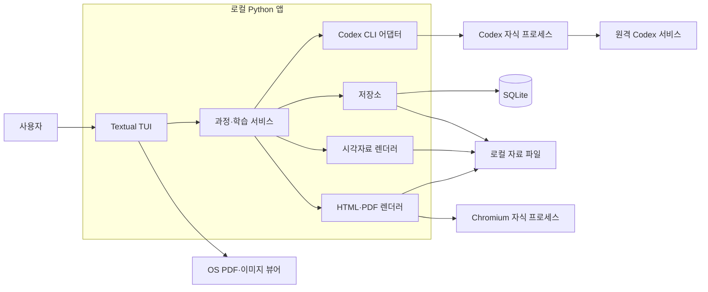
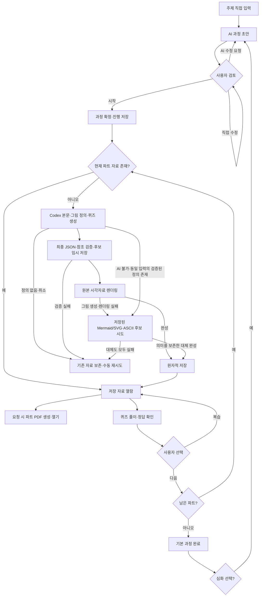

# 상세설계 (LLD)

검토 기준: 2026-10-08. 제품의 확정 요구사항은 [requirements.md](requirements.md), 작업 규칙은 [AGENTS.md](../AGENTS.md)를 따른다. 이 문서는 MVP 구현의 실제 구조와 데이터 계약을 반영한다. 77개 테스트, 실제 구독 CLI의 과정·교재·네이티브 PNG 생성, 저장 교재의 TUI 재개와 한글 PDF를 확인했다. 최종 증거와 지원 한계는 [QA 기록](qa.md)에 있다.

## 1. 목표와 첫 버전 범위

사용자가 직접 입력한 백엔드 주제를 완료 지점이 있는 과정으로 만들고, 30~45분 단위로 공부할 자료와 시각자료, 간단한 퀴즈, 파트별 인쇄용 PDF를 제공한다. 생성 자료와 진행을 저장해 중단 후 재개한다.

| 구분 | 결정 | 근거·적용 범위 |
| --- | --- | --- |
| 사용자 확정 | 주제 직접 입력 | 이력서 업로드·분석과 앱 내부 주제 추천은 제외한다. 다른 GPT 대화의 추천 주제를 입력할 수 있다. |
| 사용자 확정 | AI 과정 초안 → 사용자 조정 → 시작 | 긴 목적·난이도 설문과 진단 시험을 강제하지 않는다. |
| 사용자 확정 | 유한한 기본 과정, 선택 심화 과정 | 심화 후보와 공부할 이유를 제시하고, 선택한 주제로 새 과정을 만든다. |
| 사용자 확정 | 단순 퀴즈와 사용자 판단 | 자동 채점·AI 답안 평가·통과 점수·강제 재시험·적응형 보충은 없다. |
| 사용자 확정 | 시각자료 필수, 파트별 PDF | 첫 버전에 과정 합본은 없다. 본문·예시·그림·문제와 분리된 정답을 포함한다. |
| 사용자 확정 | 그림 실패 시 의미를 보존하는 대체 | 이미지/렌더링 실패는 저장된 Mermaid/SVG·ASCII 후보로 대체한다. 대체 사실과 선택적 원본 재시도를 표시한다. |
| 사용자 확정 | Python + Textual | Java/Spring 경험에 맞출 필요가 없다. Textual의 화면·입력·worker 기능을 활용한다. |
| 사용자 확정 | Codex CLI 자식 프로세스 + 기존 ChatGPT 구독 인증 | Responses API 직접 연동, API key 인증과 별도 유료 API로의 자동 전환은 없다. 구독 한도는 적용된다. |
| 사용자 확정 | 개인용 로컬 앱, 별도 HTTP 서버 없음 | AI 추론·검색은 원격 Codex 서비스에 의존한다. 오프라인 AI 앱으로 설명하지 않는다. |
| 설계 기본값 | SQLite + 로컬 파일 | 진행·참조·상태는 DB에, 본문 JSON·SVG·이미지·PDF는 파일에 둔다. 별도 DB 서버가 필요 없다. |
| 설계 기본값 | HTML/CSS 교재 템플릿 + Playwright/Chromium PDF | 글·코드·벡터 그림을 같은 인쇄 레이아웃으로 다루기 쉽다. 웹 UI가 아니다. |
| 설계 기본값 | Mermaid/SVG 기본, 필요한 생성 삽화 병행 | 도식으로 개념 설명을 먼저 보장한다. 구독 경로 이미지 생성·파일 수집을 검증해 provider로 연결했다. draw.io 동시 통합은 필수가 아니다. |
| 설계 기본값 | 진행 자동 저장, AI 작업 동시 실행 1개 | 작은 개인 앱에서 복구와 구독 사용량 관리를 단순하게 유지한다. |

SQLite는 별도 서버 프로세스를 요구하지 않는 내장 DB이고, Playwright의 `page.pdf()`는 인쇄 CSS로 PDF를 생성한다. 위 조합은 설계상의 채택안이며 개별 도구를 사용자가 직접 확정했다는 뜻은 아니다. [Python sqlite3](https://docs.python.org/3/library/sqlite3.html), [Playwright PDF](https://playwright.dev/python/docs/api/class-page#page-pdf).

## 2. 구성과 책임

Python 앱 한 개가 Textual 이벤트 루프, 내부 서비스, 저장소를 소유한다. Codex CLI와 Chromium은 필요한 동안만 실행되는 자식 프로세스다. 네트워크 서버나 서비스 간 HTTP API를 만들지 않는다.



### ASCII 아키텍처

```text
 User
   |
   v
+----------------- Local Python app -----------------+
| Textual TUI --> Course / Learning Service          |
|     |                   |                          |
|     |                   +--> Codex Adapter --------+--> (A)
|     |                   +--> Repository            |
|     |                   |      +--> SQLite / Files |
|     |                   +--> Visuals --> Files     |
|     |                   +--> HTML / PDF -----------+--> (B)
+-----|----------------------------------------------+
      +--> OS Viewer (PDF / Image)

(A) --> Codex CLI (child) --> Remote Codex service
        cwd: <data_root>/jobs/<job_id>
        auth: existing ChatGPT subscription
(B) --> Chromium (child) --> Part PDF --> Files
```

`Course / Learning Service`는 과정·학습 서비스, `Repository`는 저장소, `Visuals`는 시각자료 렌더러다. `(A)`와 `(B)`는 앱 경계 밖의 자식 프로세스 호출이다. Codex는 원격 서비스에서 생성하며, CLI의 작업 루트는 학습 데이터 디렉터리이고 앱 코드 저장소가 아니다. Textual은 글·퀴즈·그림 설명을 표시하고 OS 뷰어로 PDF·이미지를 연다.

이 ASCII 아키텍처는 설계 검토용이다. 학습 자료의 런타임 fallback은 아래 7·8절의 원본/대체 후보 계약을 따른다.

| 구성요소 | 책임 |
| --- | --- |
| `src/study_tui/app.py` | `StudyApp`: 과정 목록·텍스트 초안 편집·본문·퀴즈·후속 과정 화면, 작업 상태와 입력. SQL·CLI 출력 파싱은 하지 않는다. |
| `src/study_tui/service.py` | `StudyService`: 초안 생성·확정, 파트 자료 캐시·생성·재생성, 정답 공개, 다음 선택, 새 후속 과정. |
| `src/study_tui/codex.py` | `CodexGenerator`: 구독 인증 사전 확인, subprocess·JSONL, 최종 JSON 검증, 취소·실패 처리, 네이티브 그림 호출. |
| `src/study_tui/storage.py` | `Repository`: SQLite 트랜잭션, 원자적 파일 저장, 현재 자료 참조·답 메모·섹션·스크롤 위치. |
| `src/study_tui/rendering.py` | `VisualRenderer`: 저장된 그림 후보 선택·검사·렌더링. `PDFExporter`: 같은 Lesson·선택 자산에서 인쇄 HTML/PDF 생성. |
| `src/study_tui/models.py`, `schemas.py`, `schemas/` | 검증된 JSON dict 계약, 생성 스키마와 ID·출처·그림 참조 검증. |
| `src/study_tui/assets/` | 로컬 Mermaid 번들·폰트와 각 라이선스·출처. |
| `src/study_tui/demo.py`, `__main__.py` | 명시적으로 표시하는 고정 DB 인덱스 데모, CLI 옵션과 앱 실행. |

Python은 3.12 이상을 사용한다. [pyproject.toml](../pyproject.toml)에 Textual 8.2.8, jsonschema 4.26.0, Playwright 1.63.0 등 직접 의존성과 개발 도구 버전을 고정한다. Chromium은 `python -m playwright install chromium`으로 로컬 설치하며 실행 파일을 저장소에 포함하지 않는다. Mermaid 11.12.2와 Noto Sans KR·Noto Sans Mono는 패키지의 로컬 자산으로 배포한다. 출처·해시·각 라이선스는 [assets/NOTICE.md](../src/study_tui/assets/NOTICE.md)에 기록한다.

실환경 검증 기준은 macOS arm64, Python 3.12.14, Codex CLI 0.160.1이다. Linux·Windows 실행을 같은 수준으로 검증했다고 주장하지 않는다.

## 3. 화면과 키 동작

기본 이동은 `Tab`/방향키, 버튼 선택은 `Enter` 또는 클릭이다. 입력에 포커스가 있으면 글자는 입력 문자로 처리한다. `Ctrl+S`는 계획 또는 읽던 위치·메모 저장, `Ctrl+X`는 생성 취소, `Esc`는 작업 중 취소/평상시 과정 목록 이동이다. `Ctrl+Q`는 진행을 저장하고 작업 프로세스를 정리한 뒤 종료한다. 작업 동작은 화면에 표시한 버튼으로 제공한다.

| 화면 | 표시·입력 | 동작 |
| --- | --- | --- |
| 과정 목록 | 주제·현재 파트·진행, 새 주제 입력 버튼 | 새 과정 또는 저장된 과정의 마지막 위치로 재개. |
| 주제 입력 | 주제 한 줄 | `Enter`로 초안 요청. 빈 입력은 안내하며 설문·진단을 요구하지 않는다. |
| 과정 초안 | 제목·목표·범위의 일반 텍스트 입력, `분 \| 제목 \| 목표; 목표` 형식의 파트 목록 | 직접 편집 → 계획 저장 또는 이 계획으로 시작. 짧은 조정 요청 후 AI로 조정을 누를 때만 다시 생성한다. |
| 파트 본문 | 개념·원리·예시·그림/ASCII·설명·출처 | 과정 내 파트·본문 섹션 선택, 이전/다음 내용, 그림 열기, 파트 PDF, 교재 다시 생성, 사용자 판단으로 다음 파트. |
| 퀴즈 | 문제·선택 입력란, 종이 풀이 안내 | 정답과 해설 보기 또는 다음 파트 버튼. 답 입력·제출·정답 공개를 이동 조건으로 요구하지 않는다. |
| 정답·다음 선택 | 정답·해설, 복습·다음·후속 주제 후보 | 본문 섹션으로 복습하거나 현재 파트 완료 후 미완료 파트로 이동한다. 모든 파트가 완료되면 기본 과정 완료 화면으로 이동한다. |
| 파트 PDF | 생성 상태·저장 위치 | 파트 PDF 버튼으로 자료 폴더의 PDF를 생성/재사용하고 OS 뷰어로 연다. 뷰어에서 인쇄·복사한다. |
| 과정 완료·심화 | 완료한 기본 과정, 파트 다시 읽기, 후보 주제와 공부할 이유 | 파트를 선택해 복습해도 완료 상태를 유지한다. 후속 후보를 선택할 때만 새 과정 초안을 검토한다. |
| 생성 작업 표시 | 실행 단계·최근 작업 설명 | `Ctrl+X` 또는 작업 중 `Esc`로 취소. 미완성 자료를 본문으로 공개하지 않는다. 경과 시간과 종료 상태는 작업 진단 파일에도 기록한다. |

TUI는 본문·코드·퀴즈·그림 설명과 ASCII 도식을 표시하고, 실제 SVG/이미지와 인쇄 레이아웃은 외부 뷰어로 연다. 터미널 그래픽 프로토콜 지원을 첫 버전 필수로 두지 않는다. PDF 내보내기는 퀴즈 풀이 여부와 무관하게 허용한다. 정답 공개는 앱에서만 상태로 제어하고, PDF에는 별도 정답 페이지를 넣는다.

## 4. 생성 흐름과 상태



### ASCII 데이터 흐름

```text
Topic -> AI Plan -> Review / Adjust -> Start -> Save Plan
           ^              |
           +-- AI request--+
                          |
                          +-- manual edit --> Review / Adjust

Save Plan -> Current Part
                  |
                  +-- ready material --> Load ---------+
                  |                                    |
                  +-- no material --> Codex (remote)   |
                                          |            |
                                   Structured JSON     |
                                          |            |
                                   Validate / stage    |
                                          |            |
                                   Render / fallback   |
                                          |            |
                                         Save ---------+
                                                       |
                                                       v
                                                     Lesson

Lesson --> TUI / Quiz --> Answers / Review / Next (user)
   |
   +-- PDF request --> HTML --> Chromium --> Part PDF --> OS Viewer
```

`Review / Adjust`에서 직접 수정하거나 AI 수정 요청으로 초안을 조정하고, 사용자가 시작해야 과정이 확정된다. `ready material`은 검증·렌더링·저장이 완료된 기존 자료다. 최종 JSON과 참조를 검사한 뒤 원본 또는 의미를 보존하는 대체 시각자료를 완성해 저장한다. TUI와 요청 시 생성하는 파트 PDF는 같은 `Lesson`과 선택된 자산을 사용한다.

본문 생성·검증이 실패하거나 취소되면 기존 자료를 보존한다. 그림만 실패하면 저장된 대체 후보를 먼저 사용하며 대체도 모두 실패할 때 미완성/재시도를 안내한다. 복습은 저장 자료로 돌아가고 다음은 남은 미완료 파트로 이동한다. 모든 파트가 완료되면 기본 과정을 완료하며 선택한 심화 주제만 새 과정 초안으로 이어진다. 채점·통과 조건은 없다.

`N → B`는 원래 과정 연장이 아니라 선택 주제의 **새 과정 초안**이다. 다음 파트 자료는 사용자가 진입할 때 생성하며 과정 전체를 미리 자동 생성하지 않는다.

| 상태 축 | 값 | 의미 |
| --- | --- | --- |
| 과정 `status` | `draft`, `active`, `completed` | 사용자 초안 확정·기본 과정 완료 상태. |
| 작업 `status` | `queued`, `running`, `succeeded`, `failed`, `cancelled`, `interrupted` | 생성·렌더링 시도의 실행 상태. `interrupted`는 앱 강제 종료 후 복구 시 표시한다. |
| 자료 `state` | `staging`, `ready`, `failed` | JSON 검증 후 각 필수 그림의 원본 또는 의미를 보존하는 대체가 완성되면 `ready`. |
| 파트 학습 `status` | `not_started`, `studying`, `completed` | 본문 열람과 사용자의 다음 선택으로 변한다. 생성 성공이나 퀴즈 정답은 완료 조건이 아니다. |
| PDF 상태 | `missing`, `ready`, `failed` | 해당 자료·템플릿 버전의 PDF 상태. PDF 실패가 본문 학습 완료를 취소하지 않는다. |

복습은 기존 완료를 되돌리지 않는다. 다음 선택은 현재 파트를 완료 표시하고 뒤쪽 미완료 파트부터 찾으며, 없으면 과정의 첫 미완료 파트로 돌아간다. 모든 확정 파트가 완료되어야 과정이 `completed`가 된다. 파트 선택으로 마지막 파트부터 읽어도 앞의 파트를 자동 완료하지 않는다. 이미 완료된 과정의 다음은 파트 순서대로 복습하되 과정 상태를 유지한다. 저장하는 답안은 문자열 메모일 뿐이며 정답 비교·점수·평가 모델은 만들지 않는다. 다음 이동에 정답 공개나 답안 입력을 강제하지 않는다.

## 5. 내부 인터페이스와 데이터 계약

공개 데이터는 JSON Schema와 추가 참조 검증을 통과한 일반 JSON `dict`다. CLI 응답·저장·TUI·PDF가 같은 표현을 사용하며, 데이터 클래스 변환으로 별도 본문을 만들지 않는다. `validate_plan()`·`validate_lesson()`은 검증한 복사본을 반환한다. 검증 오류는 원시 생성 내용 없이 필드 경로와 규칙을 알린다.

| 데이터 | 주요 필드·표현 |
| --- | --- |
| 과정 계획 | `schema_version`, `topic`, `title`, `objectives[]`, `scope`, `parts[]` |
| 파트 개요 | `ordinal`, `title`, `objectives[]`, `minutes`(30~45) |
| Lesson | `schema_version`, `title`, `minutes`, `sections[]`, `visuals[]`, `quizzes[]`, `sources[]`, `follow_ups[]` |
| 그림 정의 | `id`, `kind`(mermaid/svg/image_prompt/ascii), `source`, `caption`, `alt_text`, `fallbacks[]` |
| 대체 정의 | `kind`(mermaid/svg/ascii), `source`. 중첩 fallback과 새 이미지 생성 요청은 없다. |
| 자료 dict | `id`, `part_id`, `revision`, `state`, `lesson_path`, `content_hash`, `input_hash`, `assets[]` 등 DB 메타데이터 |
| 자산 dict | `visual_id`, `requested_kind`, `kind`(선택된 svg/image/ascii), `source_path`, `rendered_path`, `sha256`, `status`, `fallback_used`, `fallback_reason`(nullable) |
| 진행 dict | `part_id`, `material_id`(nullable), `status`, `section_index`, `scroll_y`, `answers`, `answers_revealed`, `updated_at` |
| 생성 실패 | `GenerationFailure` 예외의 `category`, 안전한 메시지, `retryable`. 종료 코드는 작업 진단에 저장한다. |
| PDF | `PDFExporter.export()`가 반환하는 완성된 `Path`; 해시와 템플릿 메타데이터는 `render-manifest.json`에 저장한다. |

자산 경로는 렌더러 반환 시 **자료 디렉터리 기준**이고, `Repository`가 파일·해시를 확인한 뒤 DB에 **data_root 기준**으로 저장한다. PDF 호출 시 TUI가 자료 기준으로 다시 변환한다. TUI 작업 상태는 `on_event(message)` 콜백으로 전달하며, 총량을 모르는 작업에 임의의 진행률을 붙이지 않는다.

```python
# 실제 컴포넌트의 공개 메서드 요약. repo는 Repository 인스턴스다.
class StudyService:
    async def propose_plan(self, topic: str, feedback: str | None = None,
                           previous: dict | None = None) -> dict: ...
    def save_draft(self, plan: dict, course_id: str | None = None,
                   parent_course_id: str | None = None) -> str: ...
    def start_course(self, course_id: str) -> str: ...  # 첫 part_id
    async def ensure_material(self, part_id: str, regenerate: bool = False) -> dict: ...
    def save_progress(self, part_id: str, *, section_index: int | None = None,
                      scroll_y: float | None = None, answers: dict[str, str] | None = None,
                      answers_revealed: bool | None = None) -> dict: ...
    def reveal_answers(self, part_id: str) -> dict: ...
    def choose_next(self, part_id: str) -> str | None: ...
    def resume_course(self, course_id: str) -> str | None: ...
    async def create_follow_up(self, course_id: str, topic: str) -> str: ...

class CodexGenerator:
    async def generate_plan(self, topic: str, feedback: str | None = None,
                            previous: dict | None = None) -> dict: ...
    async def generate_lesson(self, plan: dict, ordinal: int,
                              prior_summary: str = "") -> dict: ...
    async def generate_image(self, prompt: str, destination: Path) -> Path: ...

class VisualRenderer:
    async def render_visuals(self, lesson: dict, material_dir: Path) -> list[dict]: ...
    async def retry_original(self, visual: dict, material_dir: Path,
                             current_asset: dict) -> dict: ...

class PDFExporter:
    async def export(self, lesson: dict, assets: list[dict], material_dir: Path) -> Path: ...

# repo.get_plan/course/part/progress/material(), repo.load_lesson(), repo.get_assets()
# repo.replace_asset(material_id, asset)는 새 자산을 검증하고 갱신된 자료 dict를 반환한다.
# repo.select_part(part_id)는 마지막으로 선택한 파트를 저장하며 과정 완료 상태를 바꾸지 않는다.
# Ctrl+X/Esc/종료는 Textual worker를 취소하고 CLI 어댑터의 프로세스 정리를 기다린다.
```

### 생성 JSON Schema

아래는 본문 생성의 전체 필드 계약이다. 생성 응답에 DB ID·로컬 절대 경로·Python 코드·임의 HTML을 요청하지 않는다. 자료·그림·문제의 ID와 파일명은 앱이 검증/생성한다. 스키마는 앱의 전체 검증 기준이다. Codex CLI의 strict 출력 스키마가 요구하는 명시적 `type`을 `const`·`enum` 필드에도 둔다. CLI에 보낼 복사본에서 지원하지 않는 `format: "uri"`만 제거하며, 반환 후에는 아래 원본 스키마와 HTTP(S) URL·호스트 검증을 모두 수행한다. 전송 호환 조정으로 로컬 검증을 약화하지 않는다.

```json
{
  "$schema": "https://json-schema.org/draft/2020-12/schema",
  "type": "object",
  "additionalProperties": false,
  "required": ["schema_version", "title", "minutes", "sections", "visuals", "quizzes", "sources", "follow_ups"],
  "properties": {
    "schema_version": {"type": "integer", "const": 1},
    "title": {"type": "string", "minLength": 1},
    "minutes": {"type": "integer", "minimum": 30, "maximum": 45},
    "sections": {"type": "array", "minItems": 4, "items": {"$ref": "#/$defs/section"}},
    "visuals": {"type": "array", "minItems": 1, "items": {"$ref": "#/$defs/visual"}},
    "quizzes": {"type": "array", "minItems": 1, "items": {"$ref": "#/$defs/quiz"}},
    "sources": {"type": "array", "minItems": 1, "items": {"$ref": "#/$defs/source"}},
    "follow_ups": {"type": "array", "minItems": 1, "items": {"$ref": "#/$defs/follow_up"}}
  },
  "$defs": {
    "section": {
      "type": "object", "additionalProperties": false,
      "required": ["kind", "title", "body_markdown", "visual_ids", "source_ids"],
      "properties": {
        "kind": {"type": "string", "enum": ["concept", "mechanism", "example", "summary"]},
        "title": {"type": "string", "minLength": 1},
        "body_markdown": {"type": "string", "minLength": 1},
        "visual_ids": {"type": "array", "items": {"type": "string"}},
        "source_ids": {"type": "array", "items": {"type": "string"}}
      }
    },
    "visual": {
      "type": "object", "additionalProperties": false,
      "required": ["id", "kind", "source", "caption", "alt_text", "fallbacks"],
      "properties": {
        "id": {"type": "string", "pattern": "^v[1-9][0-9]*$"},
        "kind": {"type": "string", "enum": ["mermaid", "svg", "image_prompt", "ascii"]},
        "source": {"type": "string", "minLength": 1},
        "caption": {"type": "string", "minLength": 1},
        "alt_text": {"type": "string", "minLength": 1},
        "fallbacks": {"type": "array", "maxItems": 2, "items": {"$ref": "#/$defs/fallback"}}
      }
    },
    "fallback": {
      "type": "object", "additionalProperties": false,
      "required": ["kind", "source"],
      "properties": {
        "kind": {"type": "string", "enum": ["mermaid", "svg", "ascii"]},
        "source": {"type": "string", "minLength": 1}
      }
    },
    "quiz": {
      "type": "object", "additionalProperties": false,
      "required": ["id", "question", "answer", "explanation"],
      "properties": {
        "id": {"type": "string", "pattern": "^q[1-9][0-9]*$"},
        "question": {"type": "string", "minLength": 1},
        "answer": {"type": "string", "minLength": 1},
        "explanation": {"type": "string", "minLength": 1}
      }
    },
    "source": {
      "type": "object", "additionalProperties": false,
      "required": ["id", "title", "url", "checked_at"],
      "properties": {
        "id": {"type": "string", "pattern": "^s[1-9][0-9]*$"},
        "title": {"type": "string", "minLength": 1},
        "url": {"type": "string", "format": "uri"},
        "checked_at": {"type": ["string", "null"]}
      }
    },
    "follow_up": {
      "type": "object", "additionalProperties": false,
      "required": ["topic", "reason"],
      "properties": {
        "topic": {"type": "string", "minLength": 1},
        "reason": {"type": "string", "minLength": 1}
      }
    }
  }
}
```

각 그림은 원본과 대체 후보를 같은 응답에 담아 `lesson.json`에 저장한다. JSON 검증 후 동일 입력 해시와 함께 `staging` 자료의 정의를 먼저 원자적으로 저장한다. 그림 처리가 끝나기 전에는 현재 자료 참조를 바꾸지 않으며, 중단 후에는 이 검증된 정의로 로컬 렌더링을 재개할 수 있다. 원본이 ASCII이면 `fallbacks`는 빈 배열이다. 그 외에는 의미를 보존하는 ASCII 후보를 마지막에 하나 필수로 두고, 앞에 Mermaid 또는 SVG 후보를 최대 하나 둔다. 이 관계는 JSON 파싱 후 추가 검증한다. 실패할 때 새 대체 생성 AI를 호출하지 않는다. 원본과 후보는 같은 구조·연결·순서·라벨을 설명하며 caption/alt_text는 표현 방식에 치우치지 않는 공통 개념 설명으로 작성한다.

과정 초안은 별도의 다음 스키마로 요청한다.

```json
{
  "$schema": "https://json-schema.org/draft/2020-12/schema",
  "type": "object", "additionalProperties": false,
  "required": ["schema_version", "topic", "title", "objectives", "scope", "parts"],
  "properties": {
    "schema_version": {"type": "integer", "const": 1},
    "topic": {"type": "string", "minLength": 1},
    "title": {"type": "string", "minLength": 1},
    "objectives": {"type": "array", "minItems": 1, "items": {"type": "string", "minLength": 1}},
    "scope": {"type": "string", "minLength": 1},
    "parts": {
      "type": "array", "minItems": 1,
      "items": {
        "type": "object", "additionalProperties": false,
        "required": ["ordinal", "title", "objectives", "minutes"],
        "properties": {
          "ordinal": {"type": "integer", "minimum": 1},
          "title": {"type": "string", "minLength": 1},
          "objectives": {"type": "array", "minItems": 1, "items": {"type": "string", "minLength": 1}},
          "minutes": {"type": "integer", "minimum": 30, "maximum": 45}
        }
      }
    }
  }
}
```

추가 검증은 다음 계약을 확인한다. 파트 순서는 1부터 연속, ID는 배열 안에서 고유, 참조 대상은 존재하며 모든 그림이 본문에서 참조되고 설명되어야 한다. `concept`·`mechanism`·`example`·`summary`를 모두 포함한다. URL은 HTTP(S)만 허용한다. `checked_at`은 실제 확인 정보가 있을 때만 날짜를 넣고 모르면 null로 둔다. AI가 만든 날짜를 검증된 날짜로 취급하지 않는다. Markdown의 원시 HTML과 원격 이미지는 렌더링하지 않는다. 내용의 정확성은 출처와 사용자 검토로 확인하며, 스키마 검증 성공을 사실 확인 완료로 부르지 않는다.

## 6. SQLite와 로컬 파일

DB는 메타데이터와 진행을 저장하고 큰 자료는 파일로 둔다. 모든 DB ID는 앱이 생성하는 UUID이며, 시각은 UTC ISO 8601로 저장하고 화면에서 현지 시간으로 변환한다. 외래 키를 활성화하고 SQL 값은 파라미터로 전달한다. 현재 파트가 같은 과정에, 현재 자료가 같은 파트에 속하는지도 저장 시 확인한다. 짧은 트랜잭션으로 쓰며 AI 대기 중 DB 잠금을 유지하지 않는다. 첫 버전은 앱 안의 DB 작업을 직렬화하고 연결을 스레드 간 공유하지 않는다.

| 테이블 | 주요 필드·관계 |
| --- | --- |
| `courses` | `id PK`, `topic`, `title`, `objectives_json`, `scope`, `plan_json`, `plan_revision`, `status`, `current_part_id FK parts NULL`, `parent_course_id FK courses NULL`, `created_at`, `updated_at` |
| `parts` | `id PK`, `course_id FK courses`, `ordinal`, `outline_json`, `input_hash`, `active_material_id FK materials NULL`. `UNIQUE(course_id, ordinal)`. |
| `materials` | `id PK`, `part_id FK parts`, `revision`, `state`, `input_hash`, `lesson_path`, `content_hash`, `schema_version`, `prompt_version`, `cli_version`, `reported_model NULL`, `search_mode`, `created_at`. `UNIQUE(part_id, revision)`. |
| `assets` | `id PK`, `material_id FK materials`, `visual_id`, `requested_kind`, `kind`(선택된 svg/image/ascii), `source_path`, `rendered_path`, `sha256`, `status`, `fallback_used`, `fallback_reason NULL`. `UNIQUE(material_id, visual_id)`. |
| `progress` | `part_id PK/FK parts`, `material_id FK materials NULL`, `status`, `section_index`, `scroll_y`(0 이상), `answers_json`, `answers_revealed`, `updated_at`. 답 메모는 해당 자료의 문제 ID에 연결한다. 채점·점수·통과 필드는 없다. |
| `jobs` | `id PK`, `course_id FK courses`, `part_id FK parts NULL`, `kind`(plan/lesson/visual/pdf), `status`, `phase`, `started_at`, `finished_at NULL`, `error_category NULL`, `job_dir`, `output_material_id FK materials NULL` |

원본과 후보 정의는 `lesson.json`에, `assets.source_path`에는 실제 선택한 정의 파일을 기록한다. 대체를 사용해도 원본 정의를 남겨 선택적으로 재시도할 수 있다. 원본 재시도는 성공 전까지 작동하는 대체 자산을 유지한다. 성공 시 자산만 원자적으로 교체하고 PDF 해시를 무효화하며 학습 진행·퀴즈 답 메모는 바꾸지 않는다.

PDF 메타데이터는 각 자료 디렉터리의 `render-manifest.json`에 `render_hash`, `pdf_sha256`, `template_version`, `paper`, `answers`로 둔다. PDF는 같은 디렉터리의 `lesson.pdf`다. 실패한 임시 PDF는 삭제하고 이전 완성 PDF는 보존한다. `render_hash`는 본문 JSON·그림 파일·템플릿·폰트·렌더러 설정의 해시로 계산한다. 별도 배포 서버, 사용자 테이블, 채점 이력, 범용 작업 큐는 추가하지 않는다.

```text
<data_root>/
  study.sqlite3
  settings.json                 # 앱의 비밀정보가 없는 설정
  courses/<course_id>/
    plan-r<revision>.json        # 저장된 초안·확정 과정
    parts/<part_id>/materials/<material_id>/
      lesson.json               # 본문·문제·정답·원본/대체 그림 정의
      progress-snapshot.json    # 자료 교체 전 이전 답 메모 보존용
      visuals/v1-primary.mmd   # 원본 Mermaid 정의
      visuals/v1-primary.svg   # 검사·설명을 포함한 렌더링 SVG
      visuals/v2-fallback-1.txt # 선택된 ASCII 도식, 줄/공백 보존
      visuals/v3-primary.png   # 검증·정규화한 네이티브 생성 이미지
      visual-manifest.json     # 자료 기준 자산 경로·해시·대체 이유
      lesson.html
      lesson.pdf
      render-manifest.json
  jobs/<job_id>/                # Codex 작업 루트. 앱 코드를 두지 않는다
    input.json
    schema.json
    final.json
    diagnostics.json            # 실패 분류·경과 시간 등의 안전한 요약
```

`data_root`는 앱 전용 디렉터리로 설정 가능하다. `platformdirs.user_data_path("study-tui", appauthor=False)`로 OS 기본 경로를 정하며 macOS는 `~/Library/Application Support/study-tui`다. `--data-dir`로 별도 학습 저장 위치를 지정할 수 있다. 개발용으로 저장소 안의 `data/`를 지정하면 기존 `.gitignore`로 제외된다. DB의 파일 참조는 `data_root` 기준 상대 경로이며, 절대 경로·`..`·심볼릭 링크를 통한 루트 외 참조는 거부한다.

### 재사용·수정·복구

1. 초안을 수정하면 `plan_revision`을 늘리고 새 계획 파일을 저장한다. 시작 전에는 본문을 생성하지 않는다. 제목·목표·순서·분량을 검증한 뒤 `parts`를 만든다.
2. 시작 후 확정 계획은 첫 버전에서 고정한다. 범위를 바꾸려면 명시적으로 새 과정 초안을 만들고, 원래 자료와 진행을 보존한다. 기존 과정 재개와 구분한다. 파트 선택은 `Repository.select_part()`로 마지막 열람 파트를 기억하며, 완료한 과정을 복습해도 `completed` 상태를 바꾸지 않는다.
3. 기존 `active_material_id`가 `ready`이고 필요한 파일과 해시가 일치하면 그대로 연다. AI를 호출하지 않는다. `input_hash`에는 확정 계획·파트 목표·선행 파트 요약·프롬프트/스키마 버전·검색 모드를 포함한다. 앱이 모델을 지정하지 않으므로 모델 항목은 null이며, 실제 모델을 모를 때 임의의 이름을 저장하지 않는다. 이미 완성된 자료를 읽기 위해 선행 파트 변경을 이유로 새 AI 호출을 하지 않는다.
4. 사용자가 자료 재생성을 선택하면 새 자료 리비전을 만든다. 이전 자료는 삭제하지 않는다. 새 자료가 완전히 저장된 뒤 DB 트랜잭션으로 현재 참조를 바꾼다. 실패하면 이전 자료를 유지한다.
5. 재생성으로 문제가 바뀌면 이전 답 메모를 새 문제에 연결하지 않는다. 전환할 때 해당 파트의 답 메모와 정답 공개 상태를 초기화하되 학습 완료 상태는 유지한다. 이전 메모는 전환 전에 이전 자료 폴더의 `progress-snapshot.json`으로 보존한다.
6. 파일은 같은 디렉터리의 임시 파일에서 rename한 뒤 DB 참조를 갱신한다. 비정상 종료로 남은 `staging`이나 참조 없는 파일은 재개 시 대조하며 완성된 자료 대신 공개하지 않는다.
7. 본문 스크롤 `scroll_y`는 0.5초 간격으로 변경을 저장하고, 답 메모는 입력 후 1초 동안 변경을 모아 저장한다. 섹션 선택은 `section_index`와 스크롤 0을 즉시 저장한다. 정답 공개·다음/복습 선택·화면 종료는 즉시 저장한다. 재개는 `current_part_id`, `section_index`, `scroll_y`를 읽고, 정답은 사용자가 공개한 경우에만 표시한다.
8. 시작 시 남아 있는 `queued`·`running` 작업을 `interrupted`로 바꾼다. 중간 JSONL을 이어지는 본문으로 취급하지 않고 사용자가 재시도한다. 저장된 자료는 네트워크가 없어도 볼 수 있다.

## 7. Codex CLI 어댑터

### 확인된 내용과 미검증 경계

이 컴퓨터에서 `codex-cli 0.160.1`, `codex login status`의 ChatGPT 로그인 성공, `codex exec --help`의 아래 옵션을 확인했다. 기존 구독으로 작은 실제 비대화형 응답·과정 초안·전체 Lesson을 생성했고 JSONL·최종 JSON 파일과 스키마/참조 검증을 확인했다. `image_generation`을 사용하는 네이티브 이미지 호출과 PNG 파일 수집도 작은 범위에서 성공했다. 한국어 QA 교재의 실제 TUI·PDF, 통제한 CLI 실패·취소를 확인했으며, 개별 호출 성공을 모든 교재의 정확성 보증으로 취급하지 않는다. 실제 생성·QA 수정·fixture의 구분은 [QA 기록](qa.md)에 있다.

저장된 CLI 인증을 재사용한다. 초안·교재 요청은 사용자의 생성/조정/재생성 동작에 따라 한 번 실행하고, 교재가 요구하는 `image_prompt`에는 그림별 네이티브 호출을 한 번 실행한다. 실패한 후보를 위해 새 AI 대체 교재를 요청하지 않는다. ChatGPT 인증은 구독 경로, API key 인증은 사용량 과금 경로이므로 후자로 자동 변경하지 않는다. 인증 파일/토큰을 읽거나 앱 영역으로 복사하지 않는다. [Codex 인증](https://learn.chatgpt.com/docs/auth).

### 호출 계약

다음은 구현한 초안·교재 호출의 주요 인자다. 이미지 호출만 별도 작업 폴더에서 `workspace-write`와 `--enable image_generation`을 사용한다.

```python
argv = [
    codex_executable, "exec",
    "--ignore-user-config", "--ephemeral", "--skip-git-repo-check",
    "--sandbox", "read-only", "--json", "--color", "never",
    "--output-schema", str(schema_path),
    "--output-last-message", str(final_path),
    "--cd", str(job_dir),
    "-c", 'forced_login_method="chatgpt"',
    "-c", f'web_search="{search_mode}"',
    "-c", "features.unbounded_connection_retries=false",
    "--disable", "apps", "--disable", "computer_use", "--disable", "browser_use",
    "-",
]
# search_mode는 앱이 선택하는 cached/live 열거값이다. 사용자 입력을 넣지 않는다.
# asyncio.create_subprocess_exec(*argv, stdin=PIPE, stdout=PIPE, stderr=PIPE,
#                                env=child_env, start_new_session=True)  # POSIX
# UTF-8 프롬프트를 stdin에 보내고 닫는다. shell=True를 사용하지 않는다.
```

`schema_path`·`final_path`·`job_dir`는 앱이 만드는 작업 전용 경로다. `--cd`로 Codex 작업 루트를 고정한다. `read-only`로 모델의 파일 변경을 제한하고 CLI의 `-o`로 최종 응답을 수집하며, 이 조합의 최종 파일 쓰기를 작은 실제 호출에서 확인했다. 앱이 검증한 JSON에서 자료 파일을 만든다. `--ignore-user-config`는 글로벌 설정을 읽지 않으며 인증은 유지한다. 사용자 규칙을 무시하는 `--ignore-rules`는 지정하지 않는다. 외부 앱·컴퓨터·브라우저 사용 기능과 무제한 연결 재시도는 호출 단위에서 비활성화한다.

같은 실행 환경의 `codex login status` 종료 코드와 인증 방식을 먼저 확인한다. ChatGPT 이외·미인증·판별 불가이면 생성하지 않고 안내한다. 자식 환경에서 `OPENAI_API_KEY`·`CODEX_API_KEY`를 제외하고 다른 공급자를 지정하지 않는다. 앱은 모델명을 고정하거나 `--model`을 전달하지 않고 CLI 기본값을 사용한다. 글로벌 설정과 인증을 앱에서 편집하지 않는다. `forced_login_method`는 호출 단위 보호이며, 인증 불일치 시 CLI가 로그아웃하는 사양이 있으므로 사전 확인을 필수로 하고 인증이 바뀌면 중단한다. 앱은 자동 로그인·로그아웃을 하지 않는다. CLI의 정상적인 인증 갱신은 CLI가 관리한다.

프롬프트는 요구·확정 계획·대상 파트·선행 요약·출처 정책·스키마를 담는 고정 템플릿과 데이터로 나눈다. 사용자 입력은 JSON 문자열로 데이터 영역에 넣고 셸 문자열·플래그·파일명에 보간하지 않는다. 웹 자료의 지시문은 학습 출처로 취급하며 앱 조작 지시로 채택하지 않는다. 이전 대화 전체를 무제한 전송하지 않고 저장된 요약과 필요한 정의만 보낸다.

현재 `prompt_version`은 `2`다. CLI 전달 스키마는 지원하지 않는 URI format만 제거하고 로컬 전체 스키마로 다시 검사한다. 교재 narrative 필드에는 일본어 가나 혼입을 막는 패턴을 넣고 최종 응답에도 같은 검사를 적용한다. 영어 용어·코드·출처 제목은 허용한다. 이는 일반 언어 감지기가 아니며, 실패하면 이전 자료를 보존하고 수동 재시도를 안내한다. 자동 번역·추가 AI 수정 호출은 하지 않는다.

검색 기본값은 `cached`다. DB 버전별 동작·현행 라이브러리 사양 등 최신 확인이 필요하면 사용자가 `--search live` 또는 데이터 폴더의 `settings.json`으로 `live`를 선택한다. 선택값을 호출 단위 `-c`에 전달하며 글로벌 설정은 변경하지 않는다. 본문의 주장에 출처 ID를 연결하고 일차 자료를 우선하도록 요청한다. 출처 URL·참조 검증은 사실 확인이나 최신성의 자동 보증이 아니며 사용자가 근거를 검토한다. [Codex 웹 검색](https://learn.chatgpt.com/docs/web-search).

### JSONL·최종 JSON·비동기 실행

`--json`은 **한 줄에 한 이벤트인 JSONL**이다. stdout 전체를 단일 JSON으로 파싱하지 않는다. 이벤트와 최종 학습 자료를 구분한다. [Codex 비대화형 실행](https://learn.chatgpt.com/docs/non-interactive-mode).

1. stdout과 stderr를 동시에 비동기로 읽고, stdin을 닫은 뒤에도 자식 프로세스 종료까지 둘 다 소비한다. stdout의 각 줄을 JSON으로 파싱한다.
2. `thread.started`·`turn.started`·`item.*`는 작업 단계/상태 표시용이다. `turn.completed`는 턴 완료 기록이며 자료 JSON이 아니다. `turn.failed`/`error` 또는 비정상 종료는 실패로 기록한다. 모르는 이벤트 종류는 안전하게 무시하고 자료에 넣지 않는다.
3. 작업마다 새 `final.json`을 최종 결과의 기준으로 삼는다. `item.completed`의 중간 메시지나 추론을 최종 자료로 추출하지 않는다.
4. 정상 종료·완료 이벤트·최종 파일 존재를 확인한 뒤 JSON 파싱 → 스키마 → ID/출처/그림 참조 검증을 수행한다. 실패한 결과를 `ready`로 만들지 않는다. 실제 완료/실패 이벤트 형태는 0.160.1의 작은 검증으로 fixture에 남긴다.
5. 출력을 무제한 누적하지 않는다. 상한은 JSONL 한 줄 4MiB, 최종 JSON 8MiB, 메모리에 보관하는 stderr 요약 64KiB다. 이벤트·최종 파일 한도 초과는 프로토콜 실패로 중단하고 stderr는 이후에도 소비하되 추가 보관하지 않는다. CLI 버전에 따라 조정이 필요하면 근거를 남긴다.
6. Textual async worker에서 CLI coroutine을 호출하고 메시지로 화면에 알린다. 입력 핸들러 안에서 긴 `worker.wait()`를 하지 않는다. 짧은 SQLite 쓰기 외에 무거운 렌더링/파일 작업은 worker로 실행한다. worker 예외를 TUI 종료로 연결하지 않고 서비스 오류로 표시한다. [Textual Workers](https://textual.textualize.io/guide/workers/).

앱은 AI worker를 하나만 유지하고 중복 요청은 기존 작업을 표시한다. 취소는 coroutine 종료만으로 처리하지 않는다. 자식 프로세스 종료 요청 → 최대 5초 대기 → 남은 프로세스 kill → wait를 수행한다. POSIX는 전용 프로세스 그룹으로 자손도 종료한다. Windows는 직접 자식 프로세스 종료 경로가 있으나 자손 정리와 실제 뷰어 동작까지 검증된 지원으로 주장하지 않는다. PDF와 Mermaid 렌더링은 finally에서 브라우저를 닫는다.

시간 제한 기본값은 과정 초안 180초, 본문 600초, 이미지 240초, PDF 120초다. `settings.json`에서 조정하고 초안·본문은 CLI 옵션으로도 바꾼다. JSONL 무응답만으로 실패를 판정하지 않는다. 시간 초과·취소·앱 종료에서 부분 결과를 채택하지 않고 진행 위치와 기존 자료를 보존한다.

| 오류 분류 | 처리 |
| --- | --- |
| `missing_cli` / `schema` | CLI 설치 또는 지원되지 않는 출력 스키마를 안내한다. 앱이 CLI를 임의로 설치·업데이트하지 않는다. |
| `auth` | 미인증·ChatGPT 이외의 인증을 거부한다. 사용자가 CLI에서 상태를 확인한 뒤 재시도하며 앱이 인증을 변경하지 않는다. |
| `quota` | 생성을 멈추고 사용자가 나중에 직접 재시도한다. 저장된 학습은 계속 가능하며 과금 API로 전환하지 않는다. |
| `network` / `timeout` / `cancelled` | 중간 자료를 공개하지 않고 수동 재시도한다. 취소는 사용자 동작으로 표시한다. |
| `schema` / `invalid_content` / `protocol` | JSON·참조·출력 한도 실패의 안전한 요약을 표시하고 이전 자료를 보존한다. 수정 AI 호출은 사용자가 재시도할 때만 한다. |
| `language` | 교재 설명의 가나 혼입을 거부하고 이전 자료를 보존한다. 사용자가 직접 재시도한다. |
| `render_failed` | 그림은 저장된 후보로 로컬 대체를 시도한다. 모두 실패하면 이전 자료와 미완성 상태를 유지한다. PDF 자체 실패는 PDF 상태만 갱신한다. |
| `image_unavailable` / `image_invalid` | 네이티브 이미지가 없거나 파일 검증을 통과하지 못하면 저장된 대체 후보를 사용한다. |
| `cli` / 기타 실패 | 알려진 한도·인증·네트워크 단서가 없으면 일반 CLI 실패로 안내한다. 종료 코드와 안전한 요약을 남긴다. |

실패 이벤트와 유한한 stderr 단서로 오류를 분류한다. 로그인·한도·네트워크 실패는 안전한 fixture로 시험하며, 실제 계정의 로그아웃이나 한도 소진을 시험 목적으로 유발하지 않는다. 원시 stderr·추론·토큰을 일반 로그에 저장하지 않는다. `diagnostics.json`은 작업 종류·안전한 상태 분류·종료 코드·경과 시간·CLI 버전·이벤트 종류만 담는다. 입력과 고정 프롬프트는 로컬 학습 데이터인 `input.json`에 저장하며 커밋하지 않는다. 무제한 자동 재시도를 하지 않는다.

### 작업 영역과 이미지 생성

Codex의 cwd는 `<data_root>/jobs/<job_id>`다. 앱 코드의 Git 저장소를 넘기지 않는다. 자료 생성은 read-only 출력 중심이며 추가 쓰기 디렉터리나 권한 우회를 지정하지 않는다. cwd와 read-only는 비밀정보를 포함한 전체 파일의 읽기 격리를 보장하지 않으므로 입력/작업 영역에 학습과 관계없는 파일을 넣지 않는다.

그림은 `mermaid`/`svg`/`ascii` 정의와 대체 후보를 구조화 응답으로 받아 앱에서 렌더링한다. 생성 이미지가 적합한 개념은 `image_prompt`를 보존하고 `CodexGenerator.generate_image()`에 연결한다. 네이티브 도구 호출과 실제 PNG 수집을 작은 구독 호출에서 확인했다. 교재의 Mermaid/SVG 렌더링과 저장 후보 전환, provider 취소·실패·이전 자료 보존은 자동화 검증과 실제 TUI·PDF로 확인했다. [Codex 이미지 생성](https://learn.chatgpt.com/docs/image-generation).

이미지 작업은 전용 job 폴더에서 `workspace-write`로 실행한다. 네이티브 도구를 한 번 호출해 실제 PNG를 해당 폴더의 `image.png`로 저장하고 경로·상태를 JSON으로 반환하도록 요청한다. 링크·파일 존재·실제 PNG 형식·20MiB 한도를 검사해 자료 폴더로 복사하고, 렌더러가 해상도·픽셀 수·이미지 내용을 검사한 뒤 표시 PNG로 정규화한다. `danger-full-access`나 별도 유료 이미지 API를 사용하지 않는다. `--no-images` 또는 `settings.json`의 `native_images: false`를 선택하면 저장된 대체 후보만 사용한다.

이미지 생성 기능이나 원본 렌더링이 실패하면 저장된 `fallbacks` 순서대로 Mermaid/SVG를 시도하고, 렌더링이 불가능하면 ASCII를 사용한다. 원본과 의미를 보존하는 대체 중 하나가 각 필수 그림에 대해 완성되면 자료를 `ready`로 할 수 있다. 모든 후보가 실패하면 이전 자료를 유지하고 미완성/재시도를 안내한다. 사용자 취소는 fallback 실행도 중단한다.

대체는 추가 AI 호출 없이 같은 응답에 저장한 정의로 수행한다. 로그인·구독 한도·네트워크 문제로 AI 호출 전체가 불가능하면 새 AI 대체 생성을 반복하지 않는다. 동일 입력의 이미 검증된 `Lesson`/후보가 있으면 로컬 렌더링을 재개할 수 있다. 검증된 정의가 없으면 기존 ready 자료를 열거나 수동 재시도를 안내하며 부분 JSONL은 사용하지 않는다. 유료 API로 전환하지 않는다.

TUI와 PDF의 그림 설명에 대체 표시와 이유를 넣고, TUI에서 선택적으로 원본 재시도를 제공한다. 원본 실패만으로 파트 학습을 막지 않는다. 원본 재시도는 고유 파일명으로 준비한 후 성공할 때만 자산 참조를 교체한다. 그림 재시도 성공은 PDF 캐시만 무효화하고 퀴즈 메모·학습 완료를 바꾸지 않는다.

## 8. TUI·그림·PDF의 공통 렌더링

`Lesson`과 검증된 `assets`가 공통 학습 데이터다. TUI는 section의 Markdown/코드/그림 caption을 표시하고 ASCII 자산은 고정폭 텍스트로 직접 보여준다. PDF는 같은 데이터와 선택된 자산을 고정 HTML 템플릿에 넣는다. TUI와 PDF용 본문을 AI가 따로 만들지 않는다. 정답 필드는 일반 본문 렌더링 함수에 넘기지 않는다.

ASCII `source`는 인쇄 가능한 ASCII 문자와 LF로 구성해 UTF-8/LF 바이트로 저장하고 탭·제어문자·escape sequence는 거부한다. 짧은 영문/ID 라벨의 의미를 한글 본문·caption에서 설명한다. 최대 폭은 72칸, 높이는 48줄이다. 구조·연결·순서·라벨이 본문 설명과 맞는지 교재 QA로 확인한다. 한 줄을 자동 줄바꿈하거나 자르지 않으며, 폭/페이지 기준을 충족하지 못한 후보는 완성으로 처리하지 않는다. 큰 도식은 생성 단계부터 의미를 보존하는 작은 단위로 작성하도록 요청한다.

TUI는 `.txt` 자산을 markup 없이 고정폭으로 표시하고 PDF는 escape한 내용을 `<pre class="diagram">`에 넣어 줄·공백을 보존한다. PDF 페이지 폭과 TUI 표시 폭을 확인하고, TUI가 좁으면 가로 스크롤/외부 보기로 원본 줄을 유지한다. 큰 도식은 완전한 연결을 유지하는 단위로 분할하며 페이지 경계에서 중간 연결을 잘라내지 않는다.

Mermaid는 로컬에 고정한 라이브러리로 SVG를 렌더링하며 CDN에 의존하지 않는다. `mermaid.render`의 SVG 결과를 저장하는 방식을 기본으로 한다. [Mermaid Usage](https://mermaid.js.org/config/usage.html).

SVG는 `viewBox`와 그림 설명·대체 텍스트를 갖추고 script·이벤트 핸들러·foreignObject·외부 참조를 거부한다. Mermaid 11.12.2를 strict 설정으로 실행하고 클릭·설정 재정의를 거부한다. 루트 `htmlLabels: false`와 flowchart의 호환 설정을 적용하며 결과 SVG도 검사해 foreignObject 없이 SVG 텍스트 라벨을 사용한다. 한글 라벨의 실제 표시를 QA에서 확인한다. 현재 Mermaid 문서는 루트 `htmlLabels`를 권장하며 flowchart 설정은 deprecated로 표시한다. [Mermaid HTML 라벨 설정](https://mermaid.js.org/config/schema-docs/config-properties-htmllabels.html).

앱이 관리하는 렌더러 페이지에서만 JavaScript를 실행한다. 학습 HTML은 원시 HTML을 통과시키지 않고 템플릿에서 텍스트를 escape한다. 브라우저에서는 앱이 허용한 로컬 자산 외 요청을 차단한다.

PDF는 A4 세로, 위/좌우 여백 15mm·아래 18mm, 본문 11pt/행간 1.65다. 패키지의 Noto Sans KR와 Noto Sans Mono를 로컬 `@font-face`로 사용하고, 실제 폰트 로드·`document.fonts.ready`·이미지 decode가 끝난 뒤 출력한다. 원본 폰트 바이트와 SIL OFL 1.1 라이선스를 함께 포함하며 출처·해시는 자산 NOTICE에 기록한다. 그림은 흑백으로 출력하고 SVG의 텍스트에도 같은 한글 폰트를 적용한다.

```css
@page { size: A4; margin: 15mm 15mm 18mm; }
body { font-size: 11pt; line-height: 1.65; }
h2, h3 { break-after: avoid; }
figure { break-inside: avoid; }
pre { white-space: pre-wrap; overflow-wrap: anywhere; font-size: 9pt; }
pre.diagram {
  font-family: "Lesson Mono", monospace;
  white-space: pre;
  overflow-wrap: normal;
  word-break: normal;
  break-inside: avoid;
}
img, svg { max-width: 100%; height: auto; }
.answer-section { break-before: page; }
```

본문·예시·그림·문제 → 페이지 나눔 → 정답·해설 → 출처·후속 후보 순서로 출력한다. 문제 근처의 각주·caption에 정답을 넣지 않는다. 코드·문제 전체에 `break-inside: avoid`를 무조건 적용하지 않고 읽기 좋게 분할해 공백과 잘림을 방지한다. 흑백에서도 형태·선 종류·라벨로 구분하고 색에만 의미를 맡기지 않는다. 래스터 이미지는 인쇄 폭 대비 충분한 해상도(원칙적으로 300dpi 수준)를 QA 기준으로 삼고, 그림 글자는 본문에 가까운 읽기 쉬운 크기로 한다. 이미지 파일 검증 성공만으로 인쇄 가독성이 보장됐다고 주장하지 않는다.

Playwright async API의 `await page.pdf(path=str(pdf_temp_path), format="A4", print_background=True, prefer_css_page_size=True)`를 기본으로 한다. 임시 PDF를 확인한 뒤 최종 경로로 바꾼다. 첫 버전은 현재 파트만 출력한다. 생성된 PDF는 `render_hash`가 일치하면 재사용한다. 템플릿·그림 변경은 PDF만 다시 렌더링하며 AI 본문을 재생성하는 이유로 삼지 않는다.

추가 fallback 확인 기준은 이미지 생성 실패·Mermaid 렌더링 실패를 각각 가정했을 때 저장된 후보만으로 전환되고, ASCII의 줄/공백과 본문 의미가 TUI/PDF에서 일치하며 인쇄 폭을 넘지 않는 것이다. 대체 표시·원본 재시도·후보 전부 실패 시 이전 자료 보존을 확인한다. 코드는 줄바꿈 후에도 읽을 수 있어야 하고 도식은 임의로 줄바꿈되지 않아야 한다. 통합 QA에서 실제 렌더러와 PDF 페이지로 확인한다.

확인 기준은 대표 한글 파트에서 글자 누락 없음, 본문/코드/그림 잘림 없음, 페이지 경계에서 제목과 본문이 분리되지 않음, 그림과 설명 대응, 흑백 구분, 문제 뒤 별도 페이지의 정답, TUI/PDF 학습 내용 일치, 오프라인에서 기존 PDF/그림 열람 가능이다. 구조 검사와 함께 PDF의 실제 페이지를 시각적으로 확인한다.

## 9. 구현·QA 완료 기준

아래 기준에 따라 구현·수정을 마치고 77개 테스트, 실제 생성·설치·TUI·한글 PDF와 화면 캡처를 확인했다. 실환경 확인은 macOS arm64 기준이며, 자동화 검증과 실제 호출의 구분·남은 제한은 [QA 기록](qa.md)에 있다.

| 순서 | 구현/확인 | 완료 기준 |
| --- | --- | --- |
| 1 | CLI 호환·구독 인증의 작은 검증 | 0.160.1에서 위 argv·stdin·read-only·schema·JSONL·`-o`·검색 override 확인. 실제 이벤트를 안전한 fixture로 저장. API key 환경에서도 과금 인증으로 이동하지 않는지 확인하되, 인증 불일치 시험은 사용자의 실제 인증을 사용하지 않는다. |
| 2 | 저장 모델과 고정 fixture의 Textual 화면 | 주제 입력, 초안 수정, 본문, 정답 공개, 다음/복습, 종료/재개 동작. 생성 대기 중에도 입력/취소에 응답. |
| 3 | 과정 초안 → 파트 하나 실제 생성 | 30~45분, 필요한 장·출처·참조 JSON, 필수 그림, 간단한 문제/정답 저장. 채점·통과 조건 없음. 재생성 없이 재개. |
| 4 | Mermaid/SVG·ASCII 대체와 파트 PDF | 같은 Lesson과 선택 자산에서 A4 PDF 생성. Mermaid HTML 라벨 비활성화·한글 SVG 텍스트 확인. 실패 시 저장된 ASCII 전환, 줄/공백/인쇄 폭, 대체 표시와 원본 재시도 확인. 한글/코드/흑백/정답 분리·PDF 캐시를 실제 페이지로 검증. |
| 5 | 취소·실패·강제 종료·자료 재생성 | 자식 프로세스가 남지 않고 부분 자료로 현재 자료를 덮어쓰지 않음. 후보 전부 실패 시 이전 자료·진행 보존. 구독/로그인/네트워크 문제에서 새 AI 대체를 반복하지 않고 저장된 정의만 사용하거나 수동 재시도. |
| 6 | 기본 과정 완료·선택 심화, 이미지 경로 확인 | 파트 선택으로 순서를 바꿔도 모든 확정 파트의 완료 선택 후 과정 완료. 복습은 완료 유지, 후속 후보 선택 시에만 새 초안. 네이티브 이미지의 비대화형 생성/수집/취소 검증. 미지원 시 대체와 지원 한계 명시. |

최종 확인에는 생성 Lesson의 내용·한국어 설명·그림 대응, TUI/저장/재개, 실패·취소·자손 프로세스 정리, 한글 PDF 실제 페이지, 명령과 패키지 설치 경로가 포함된다. 스키마·라이브러리·번들 자산 선택은 위 계약으로 구현했다. 로그인·구독 한도 실패는 안전한 fixture로 검증하고 실제 계정 인증 변경이나 한도 소진을 유발하지 않는다. 설치 CLI의 `--help`에서 확인하지 않은 플래그는 전제로 쓰지 않는다.

기능 QA와 수정 후 실제 화면을 캡처하고 [README](../README.md)에 실행·사용 안내를 작성했다. 저장소는 비공개로 오픈소스 공개를 준비하며, 공개 전환과 프로젝트 라이선스는 사용자가 추후 결정한다.
